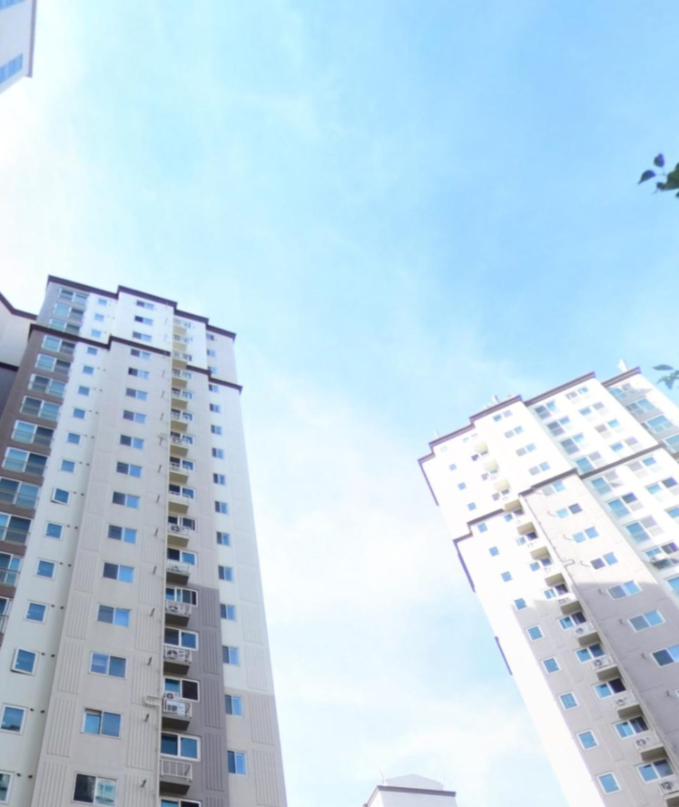
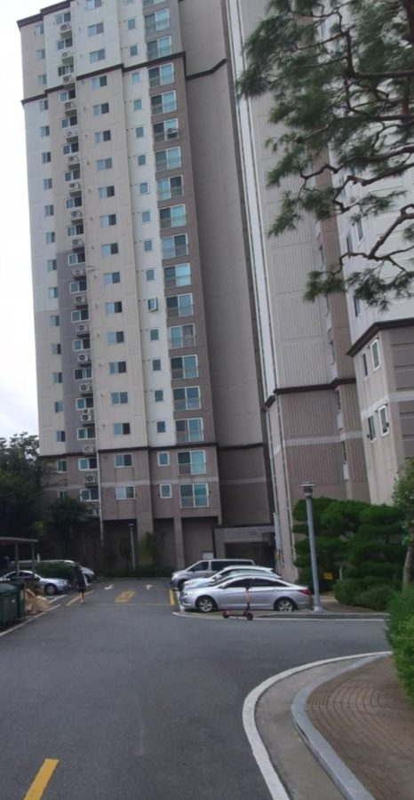
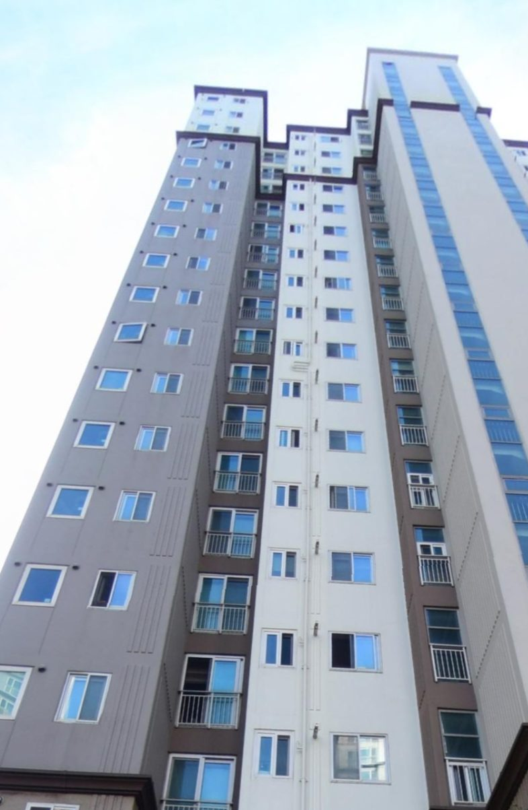
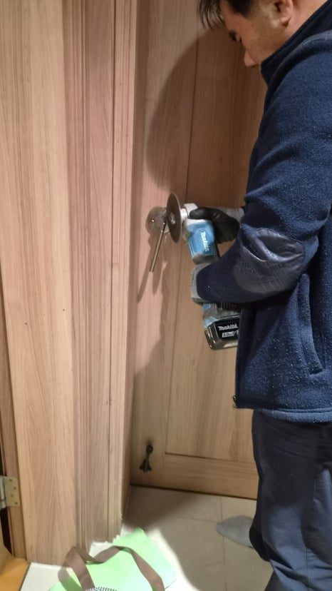
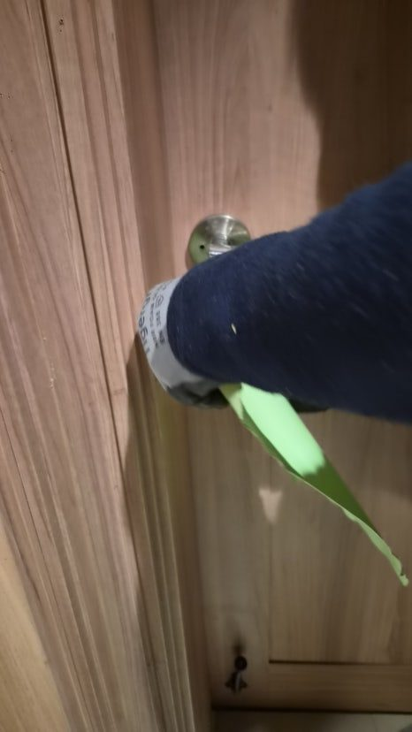
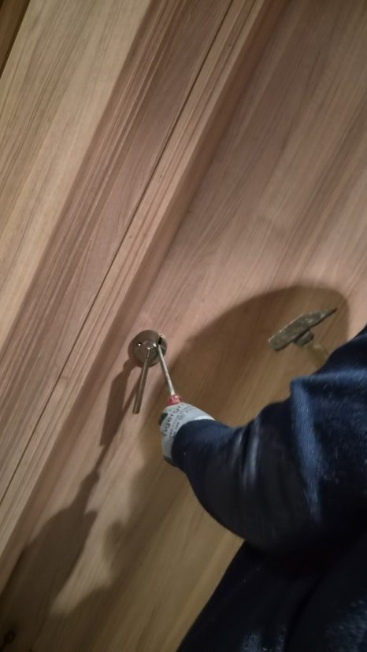
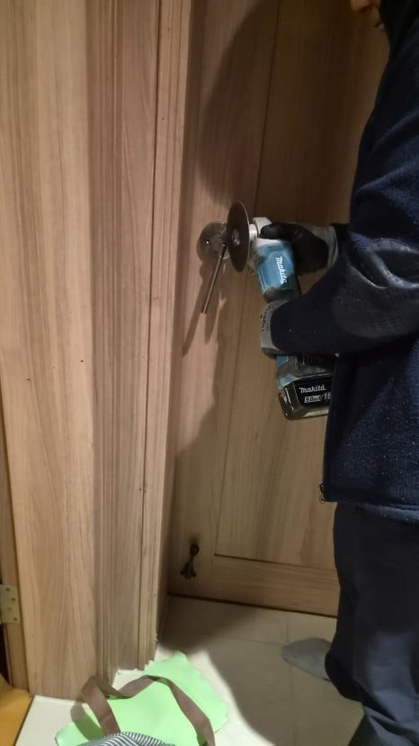
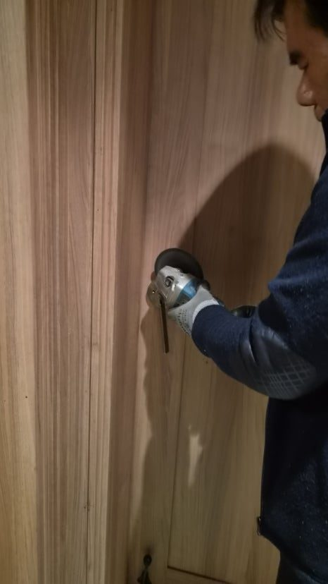
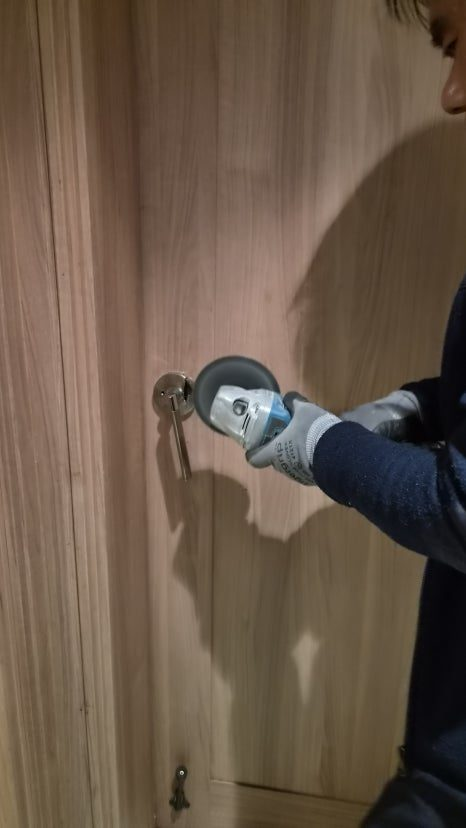
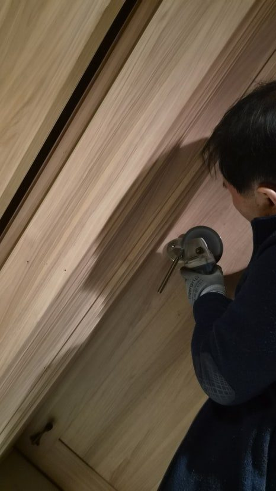

어제 늦은 밤, 울산 북구 신천동 신천엠코타운아파트에서 긴급 연락이 들어왔습니다.

방문 손잡이가 완전히 고장 나 안에서도 밖에서도 열리지 않는 상황이었습니다.

특히 방 안에는 휴식이 꼭 필요한 가족분이 계셨기 때문에 단순한 문고리 고장이 아니라 빠른 조치가 필요한 긴급 상황이었습니다.

## 방문 손잡이 고장, 단순 문제가 아닌 구조 문제입니다

많은 분들이 방문 잠김을 단순한 문고리 문제로 생각합니다.

하지만 실제 현장에서는 내부 구조 문제인 경우가 많습니다.

이번 사례 역시 마찬가지였습니다.

현장 확인 결과, 내부 실린더와 래치 부속이 완전히 엉켜 헛도는 상태였습니다.

이런 경우 힘으로 돌리거나 충격을 주면 오히려 상황이 악화됩니다.

결국 정상적인 개문은 불가능한 상태였습니다.

## 늦은 밤 방문 잠김이 더 위험한 이유

낮에는 해결 방법이 많습니다.

하지만 밤이 되면 상황은 완전히 달라집니다.

- 열쇠 업체 접근 제한
- 소음 문제
- 가족 휴식 방해

이 세 가지가 동시에 겹치기 때문입니다.

특히 아파트에서는 소음 민원까지 고려해야 하기 때문에 작업 난이도가 훨씬 높아집니다.

## 파괴 개문 작업, 기술이 없으면 더 큰 피해로 이어집니다

결국 선택한 방법은 파괴 개문 작업이었습니다.

여기서 중요한 포인트는 단순히 문을 여는 것이 아닙니다.

문짝과 문틀을 살리면서 고장 부속만 제거하는 것이 핵심입니다.

그라인더를 사용해 실린더를 절단했지만, 문틀과 타공 부위에는 단 하나의 손상도 남기지 않는 방향으로 작업을 진행했습니다.

끊어 치기 방식으로 소음을 최소화하며 정밀 절단을 진행했습니다.

이 과정에서 30년 현장 경험이 그대로 드러납니다.

## 소음 민원 상황에서도 빠르게 해결한 이유

야간 작업에서 가장 중요한 요소는 속도와 정밀도입니다.

작업 중 소음으로 민원이 발생했지만, 이웃분들께 양해를 구하고 최대한 짧은 시간 안에 작업을 마무리했습니다.

단순히 빠르게가 아니라, 정확하게 빠르게 진행하는 것이 핵심입니다.

이 차이가 결국 현장 결과를 바꿉니다.

## 방문 손잡이 교체, 재발 방지까지 완벽하게

문이 열린 뒤 바로 새 방문 손잡이 교체 작업을 진행했습니다.

기존 파손 부속 제거
타공 부위 보정
수평 정렬 세팅

이 세 가지를 정확히 맞춰야 재발이 없습니다.

교체 후에는

- 문 열림 테스트 5회 이상
- 잠금 작동 테스트
- 래치 복원력 확인

까지 진행했습니다.

## 울산 방문 잠김, 이런 증상 보이면 바로 점검하세요

다음과 같은 증상이 있다면 이미 고장 직전입니다.

- 문고리가 헛도는 느낌
- 손잡이가 돌아가도 문이 안 열림
- 닫을 때 힘이 많이 들어감
- 래치가 끝까지 안 들어감

이 상태에서 방치하면 결국 오늘 같은 긴급 상황이 됩니다.

## 울산 북구 집수리, 현장은 결국 사람이 해결합니다

신천동 신천엠코타운의 밤은 민원으로 시작해 감사로 끝났습니다.

문 하나 열렸을 뿐인데 집 안의 공기가 다시 편안해졌습니다.

이 일은 단순한 수리를 넘어 가족 구성원들의 정상적인 일상을 되돌려주는 작업입니다.

울산 북구 어디든 작은 불편도 놓치지 않고 해결합니다.

필요한 순간, 망설이지 말고 바로 움직이세요.

문은 잠겨도 해결 방법은 항상 가까이 있습니다.

## 오박사가 드리는 한마디

오박사만능인테리어는 보이지 않는 부분까지 정직하게 시공합니다.

겉만 화려한 인테리어보다 기본이 지켜지는 시공이 훨씬 중요합니다.

또한 한 달에 한 번 지역 어르신 댁을 찾아가 무상 집수리 점검도 진행하고 있습니다.

그렇게 쌓아온 진심으로 여러분의 집수리 고민을 끝까지 책임지고 해결합니다.

## FAQ

### 문고리가 헛도는데 바로 수리해야 하나요?

네. 헛도는 느낌은 내부 부속 파손의 초기 신호인 경우가 많습니다.

### 밤에 문이 안 열리면 어떻게 해야 하나요?

무리하게 힘을 주기보다 구조를 점검하고 개문 작업 여부를 판단해야 합니다.

### 실리콘만 다시 쏘면 해결되나요?

아닙니다. 구조적인 파손이 있으면 손잡이와 래치 상태를 먼저 확인해야 합니다.

### 비슷한 증상이 반복되면 어떻게 하나요?

재발 방지를 위해 손잡이, 타공 상태, 고정 부속을 함께 점검하는 것이 좋습니다.

울산 북구 신천동, 신천엠코타운, 방문 잠김, 문고리 수리, 방문 손잡이 교체, 개문 작업이 필요하다면 작은 이상 신호도 놓치지 말고 점검해 보시기 바랍니다.

한 번 시공하면 오래가도록.

오박사만능인테리어는 보이지 않는 부분까지 꼼꼼하게 확인하고 작업합니다.
