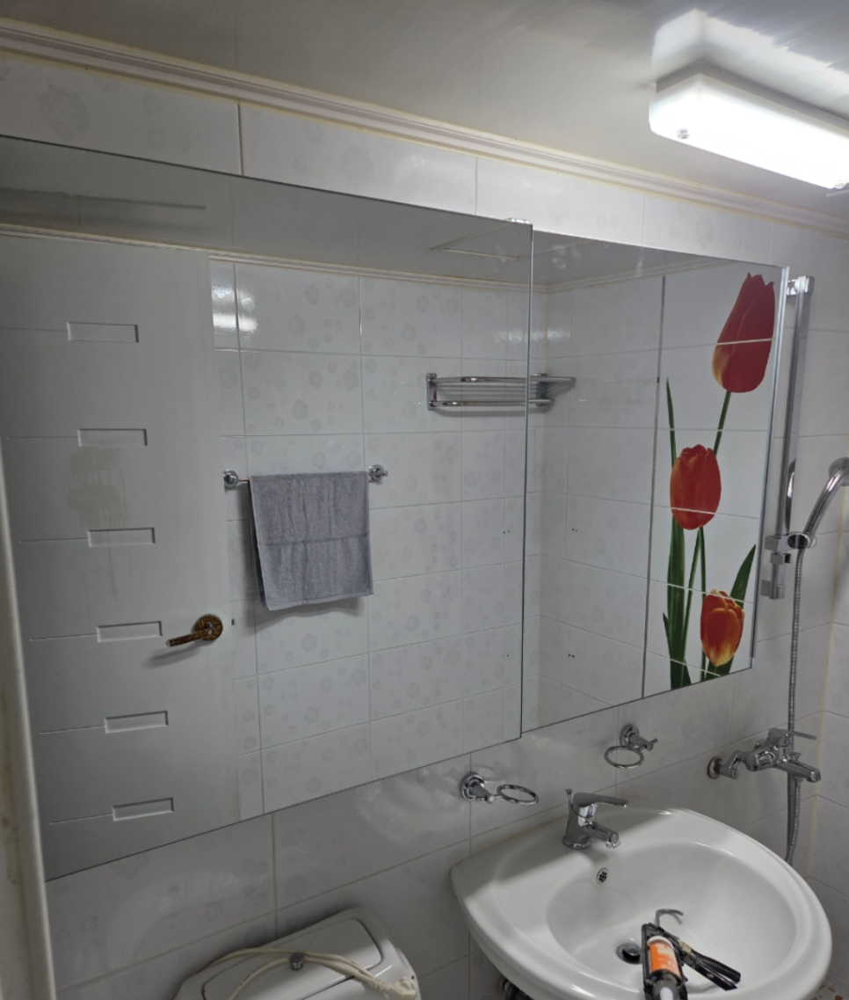
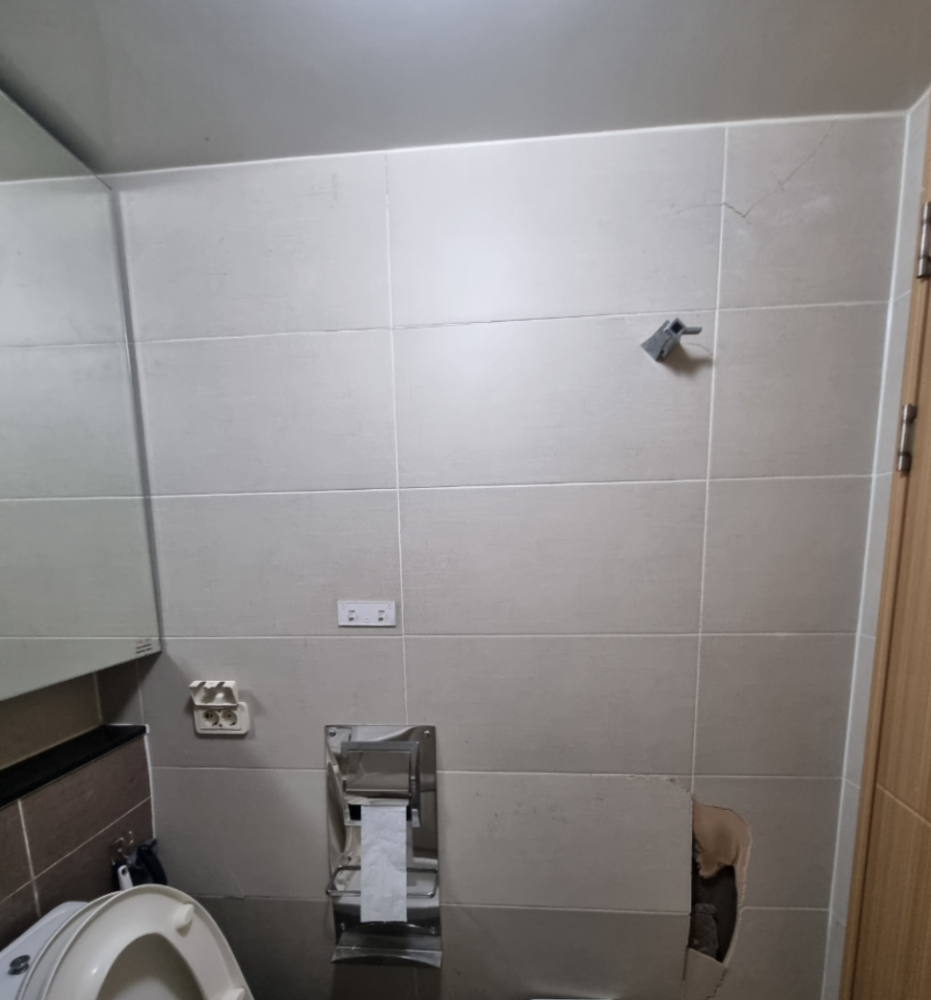
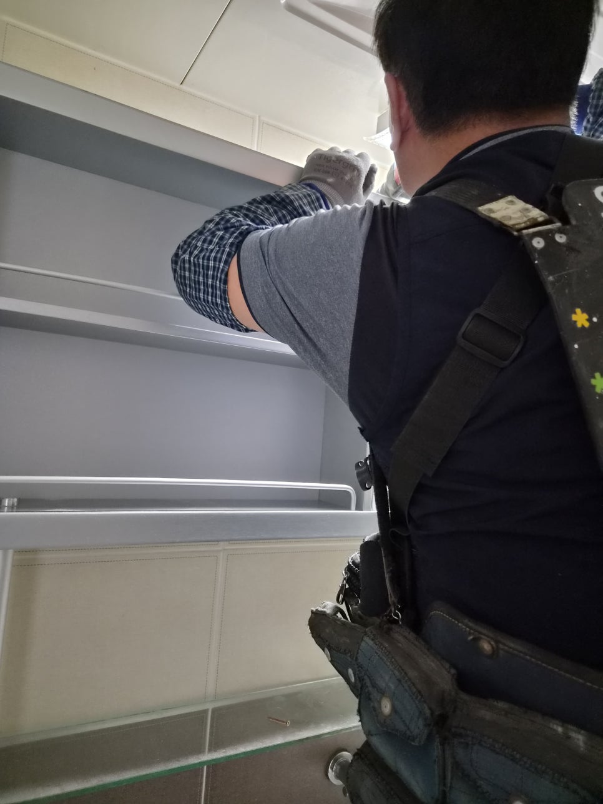
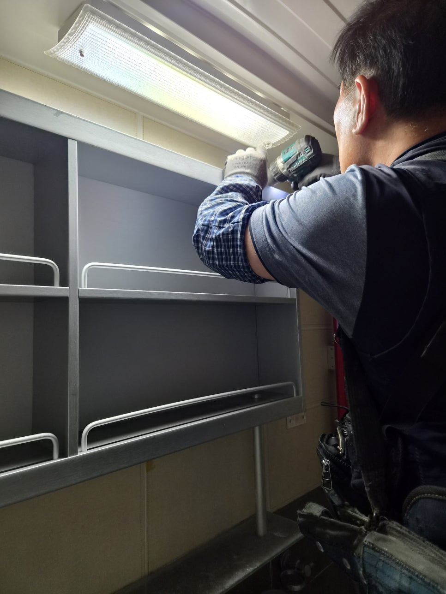
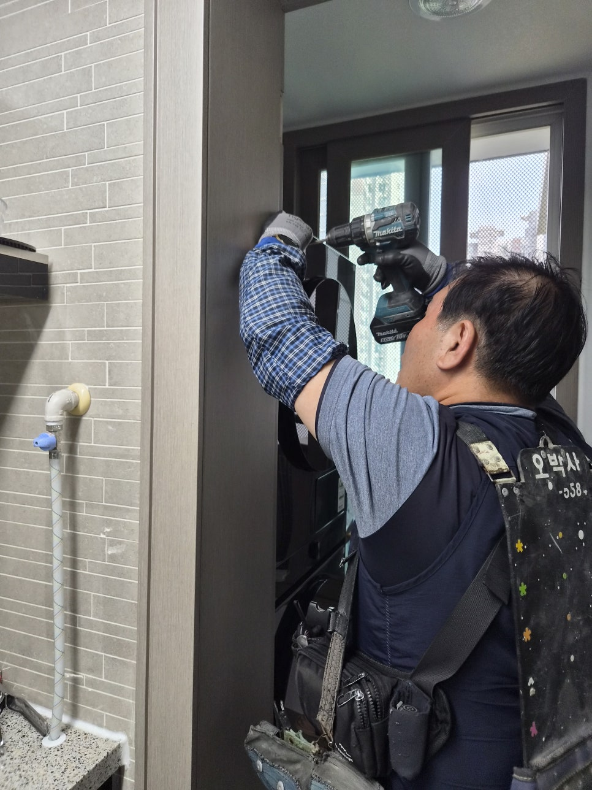
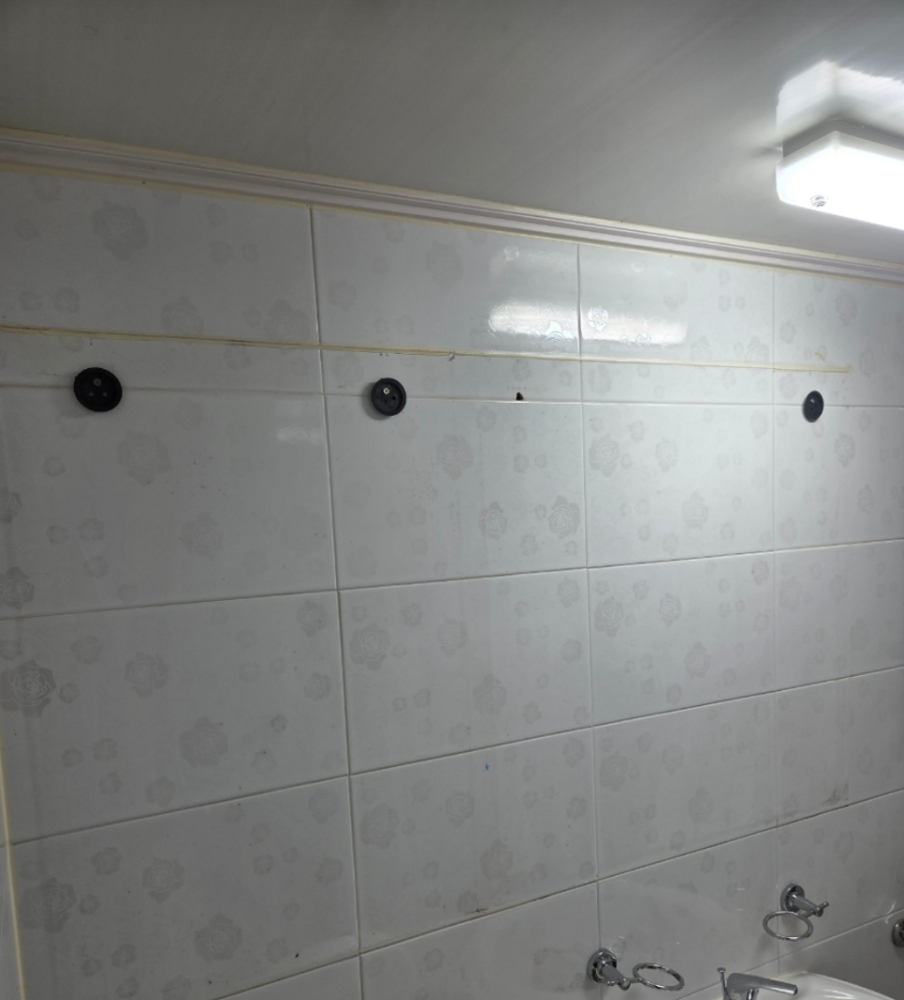
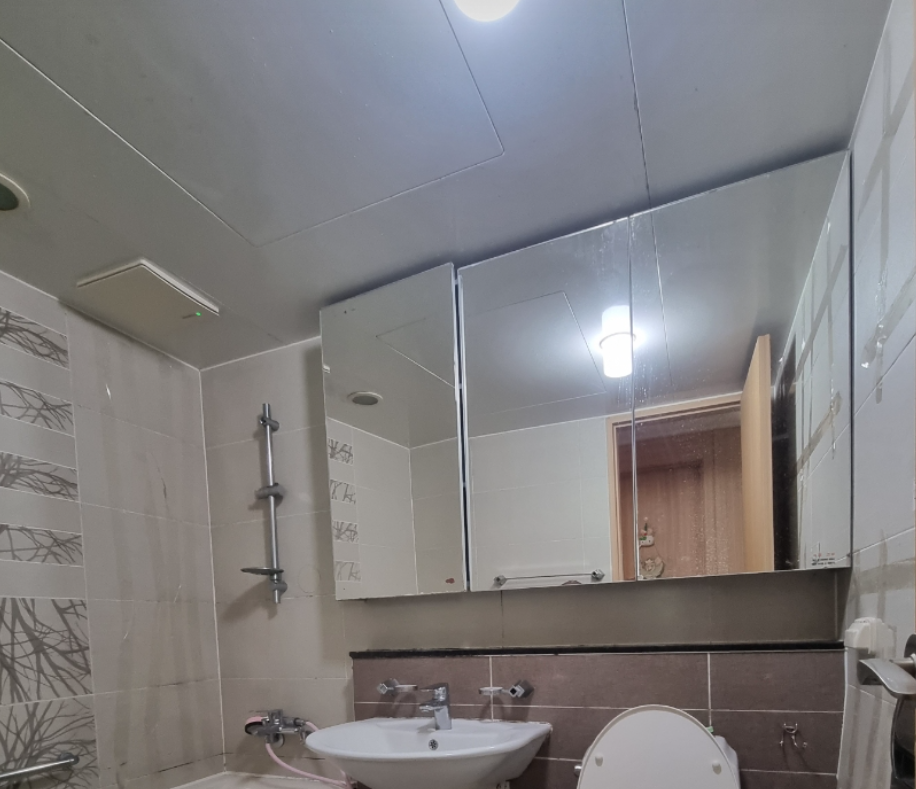

# 울산 북구 아파트 욕실 슬라이드장 떨어짐 직전, 거울장 추락 위기 긴급 고정 사례

밤은 더 작은 소리도 크게 들립니다. 울산 북구 한 아파트에서 늦은 시간에 연락이 왔습니다. “툭…” 하는 소리에 놀라 화장실 문을 열어보셨다고 합니다.

## 현장 요약

늦은 밤, 고객님께서 다급하게 연락을 주셨습니다.

욕실에서 갑자기 "툭" 하는 소리가 들려 확인해 보니 거울이 달린 슬라이드장이 벽에서 떨어질 듯 위태롭게 매달려 있었다고 합니다.

현장에 도착해 확인해 보니 예상보다 상황이 심각했습니다.

슬라이드장을 지탱하던 내부 브라켓은 이미 파손된 상태였고, 장과 벽체 사이에는 틈이 벌어져 있었습니다.

욕실 특유의 습기와 오랜 사용으로 인해 플라스틱 부품이 경화되면서 고정력을 잃은 것이 원인이었습니다.

이 상태를 그대로 두었다면 무거운 거울장이 갑자기 떨어지면서 유리 파손은 물론 가족이 다치는 사고로 이어질 수도 있는 위험한 상황이었습니다.

이번 작업은 단순히 실리콘을 다시 바르는 방식으로 접근하지 않았습니다.

벌어진 틈을 정리하고 방수와 고정을 위한 기초 작업을 진행한 뒤, 슬라이드장 본체를 벽체까지 관통해 다시 단단하게 고정했습니다.

마지막으로 코킹 마감까지 꼼꼼하게 진행해 습기 유입을 막고 내구성을 높였습니다.

작업이 끝난 후에는 장을 여러 번 열고 닫으며 흔들림 여부를 확인했고, 고객님도 이제는 안심하고 사용할 수 있겠다며 만족해하셨습니다.

작은 흔들림 하나도 그냥 지나치지 않는 것. 그것이 큰 사고를 예방하는 가장 빠른 방법입니다.

## 이미지 갤러리

현장 확인, 작업 과정, 마무리 순서로 사진을 정리했습니다.

### 원문 보기

현장 전체 흐름이 궁금하시면 원문과 릴스도 함께 확인해 보실 수 있습니다.

### 상담 안내

비슷한 문제가 보이거나 확인이 필요하시면 언제든 전화로 상담해 주세요.

전체 시공사례로 돌아가 다른 현장도 함께 살펴보실 수 있습니다.
