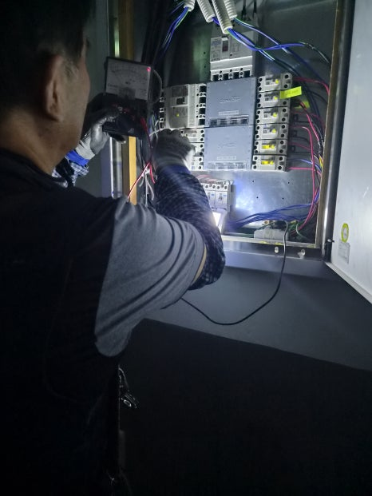
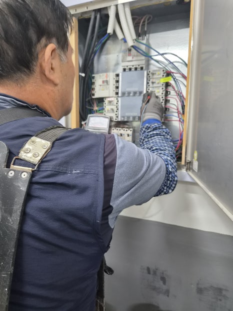
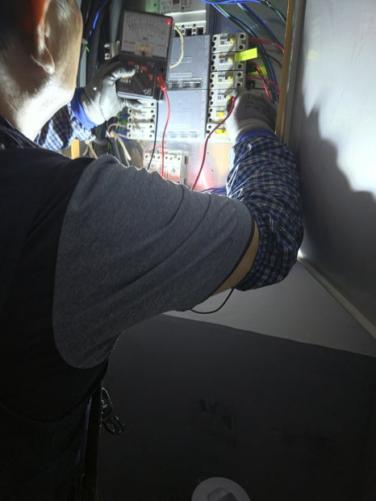
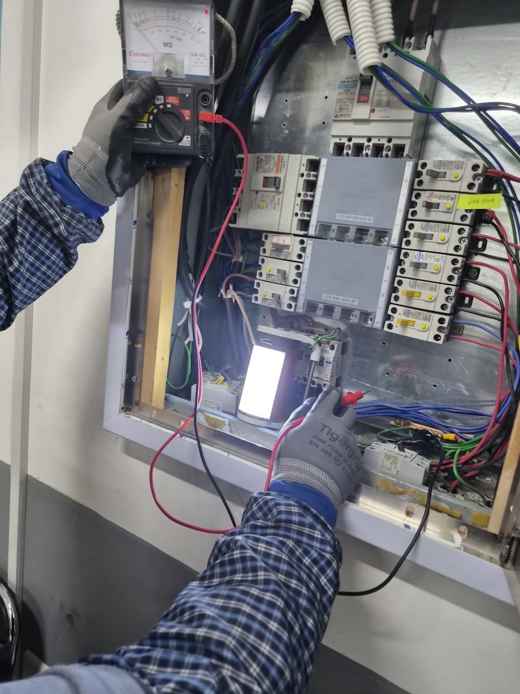
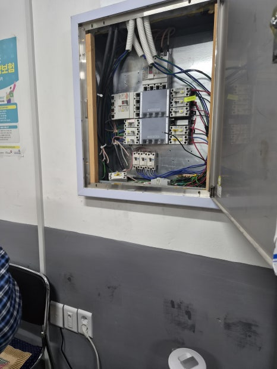
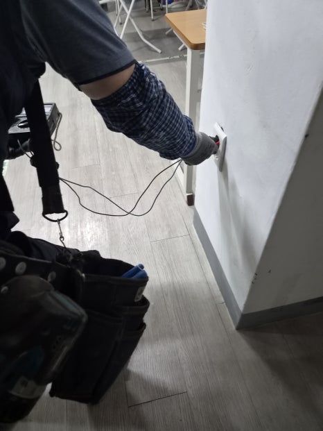
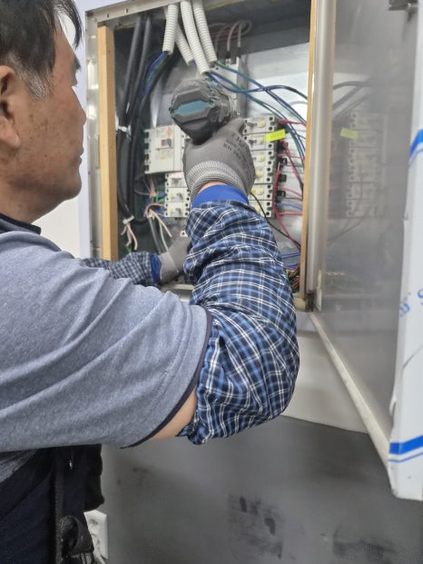

# 울산 북구 호계동 정전 해결, 요양보호사교육원 누전차단기 교체 사례

울산 북구 호계동 교육원 정전 현장에서 분전반과 누전차단기 상태를 확인하고, 원인 점검부터 교체 후 통전 확인까지 안전하게 마무리한 사례입니다.

## 현장 요약

울산 북구 호계동 교육원 정전 현장에서 분전반과 누전차단기 상태를 확인하고, 원인 점검부터 교체 후 통전 확인까지 안전하게 마무리한 사례입니다.

호계동 교육원에서 전체 전기가 멈췄다는 연락을 받고 현장으로 갔습니다. 수업이 진행되는 공간은 조명과 콘센트가 바로 복구되어야 하므로, 단순히 스위치를 다시 올리는 방식으로는 해결할 수 없다고 판단했습니다.

먼저 분전반을 열어 메인 차단기와 각 회로의 흐름을 확인했습니다. 전기가 끊긴 원인이 외부 공급 문제가 아니라 차단기 내부와 연결부 쪽 이상으로 이어질 가능성이 보여, 무리한 통전보다 원인 확인을 우선했습니다.

계측기로 누전 여부와 단락 가능성을 확인하면서 문제가 되는 구간을 좁혀갔습니다. 오래 사용한 차단기는 겉으로는 멀쩡해 보여도 내부 접점이 약해질 수 있어, 현장 사용량과 회로 구성을 함께 보고 교체 범위를 정했습니다.

기존 누전차단기를 정리한 뒤 현장에 맞는 규격으로 교체하고, 배선 체결 상태를 다시 맞췄습니다. 교체 후에는 바로 마무리하지 않고 교육원 내부 콘센트와 분전반 동작을 순서대로 확인해 같은 문제가 반복될 가능성을 줄였습니다.

전원을 다시 올렸을 때 조명과 전기 사용이 정상으로 돌아오는 것을 확인했습니다. 전기 문제는 보이지 않는 곳에서 시작되는 경우가 많기 때문에, 정전이나 차단기 내려감이 반복된다면 빠르게 점검받는 것이 가장 안전합니다.

## 이미지 갤러리

현장 확인, 작업 과정, 마무리 순서로 사진을 정리했습니다.

### 원문 보기

현장 전체 흐름이 궁금하시면 원문과 릴스도 함께 확인해 보실 수 있습니다.

### 상담 안내

비슷한 문제가 보이거나 확인이 필요하시면 언제든 전화로 상담해 주세요.

전체 시공사례로 돌아가 다른 현장도 함께 살펴보실 수 있습니다.
