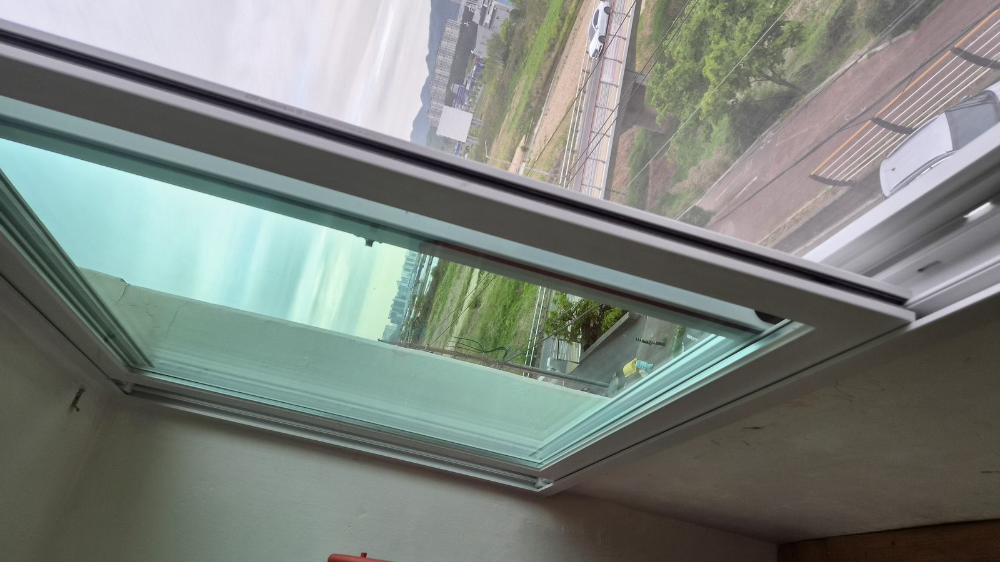
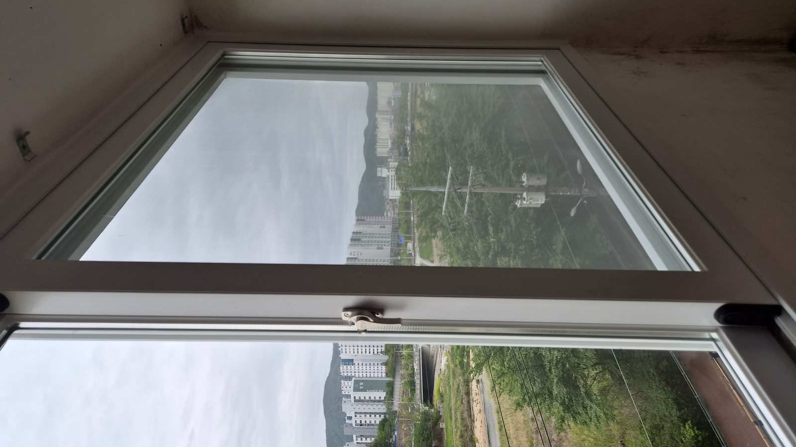
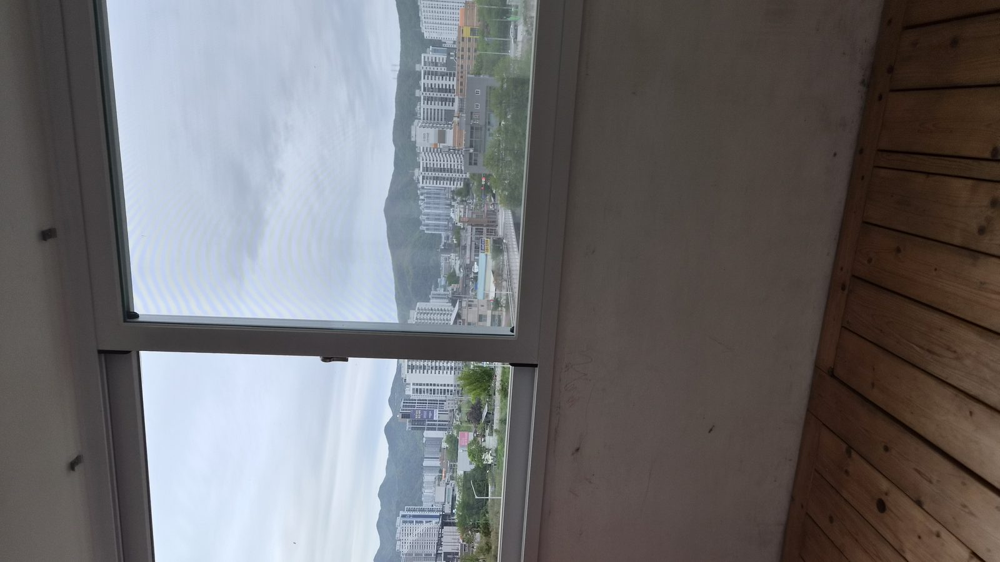
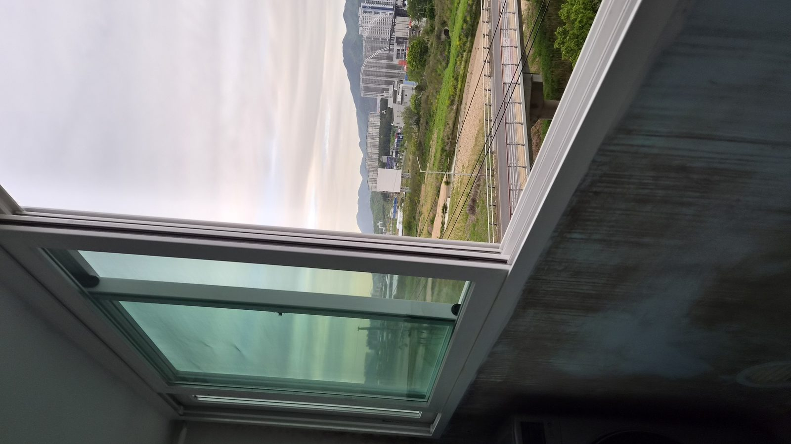
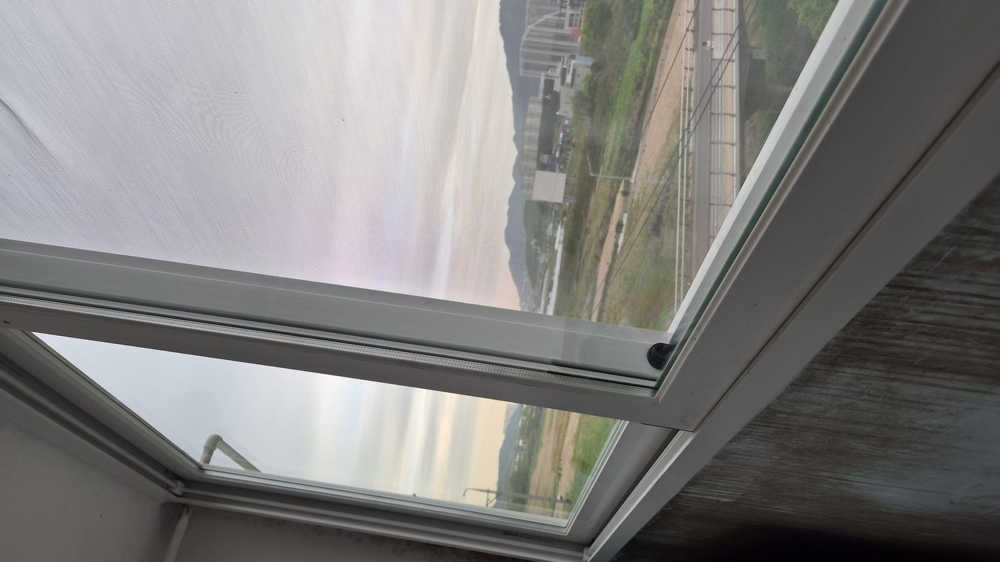
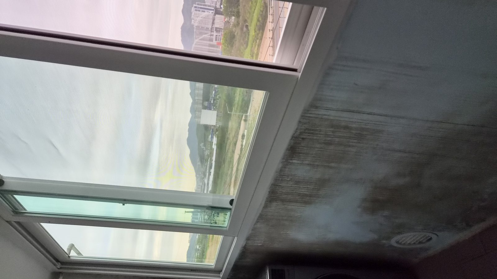

# 울산 북구 천곡동 세면대 떨어짐 사고, 아이 있는 집이라면 꼭 확인하세요

아이들은 위험을 모릅니다.

그저 재미있어서 매달리고, 기대고, 장난을 칩니다.

이번 현장은 울산 북구 천곡동 삼성코아루 아파트에서 발생한 실제 사례입니다.

놀러 온 손주가 세면대에 매달려 장난을 치던 중 세면기가 벽에서 떨어지며 아찔한 상황이 발생했습니다.

다행히 큰 부상은 없었지만 조금만 더 상황이 나빴다면 큰 사고로 이어질 수 있었습니다.

## 세면대는 생각보다 위험한 구조물입니다

많은 분들이 세면대를 단순히 벽에 붙어 있는 도기 정도로 생각합니다.

하지만 실제로는 벽 내부 브라켓과 볼트 구조가 하중을 지탱하는 방식입니다.

이 구조가 약해지면 겉으로는 멀쩡해 보여도 언제든 사고가 발생할 수 있습니다.

이번 현장 역시 브라켓 파손과 반복된 하중이 겹치면서 결국 붕괴 직전 상태까지 진행된 사례였습니다.

## 완전히 떨어지지 않은 것은 운이었습니다

현장 확인 결과 세면기가 바닥까지 추락하지 않은 이유는 하부 트랩 배관이 마지막까지 버텨주고 있었기 때문입니다.

하지만 이것은 정상 상태가 아니라 우연히 사고를 막아준 상황이었습니다.

조금만 더 힘이 가해졌다면

- 도기 파손
- 발등 부상
- 파편 사고

등으로 이어질 수 있었습니다.

## 오박사만능인테리어의 보강 작업

이런 경우 단순히 세면기를 다시 걸어놓는 방식으로는 해결되지 않습니다.

먼저 파손된 브라켓을 제거하고 고정 구조를 새롭게 재구성합니다.

이후 새로운 볼트와 너트를 사용해 기초 고정을 다시 진행합니다.

벽체와의 밀착도를 최대한 확보해 하중을 분산시키는 것이 핵심입니다.

마지막으로 세면기 전체 둘레를 따라 실리콘 코킹 작업을 진행합니다.

이 작업은 단순 마감이 아니라 방수와 고정력 보강이라는 두 가지 역할을 동시에 수행합니다.

## 세면대가 떨어지기 전 나타나는 신호

실제 현장에서는 대부분 비슷한 신호가 먼저 나타납니다.

- 세면기와 벽 사이 틈이 보인다
- 손으로 누르면 미세하게 움직인다
- 실리콘이 갈라지거나 떨어진다

이 세 가지 중 하나라도 보인다면 이미 구조가 약해지고 있다는 의미일 수 있습니다.

## 아이가 있는 집이라면 꼭 확인해야 합니다

세면대는 생각보다 무겁습니다.

그리고 벽에 단단히 고정된 것처럼 보여도 내부 구조가 약해지면 갑작스럽게 붕괴될 수 있습니다.

특히 어린아이들이 매달리거나 기대는 행동을 반복하는 경우 하중이 집중되면서 사고 위험이 크게 증가합니다.

따라서 사용 습관과 정기적인 점검이 무엇보다 중요합니다.

## 오박사가 드리는 한마디

세면기는 가구가 아닙니다.

몸을 싣는 구조물이 아닙니다.

그리고 조금이라도 흔들린다면 이미 문제는 시작된 상태일 수 있습니다.

이번 작업은 단순 수리가 아니라 가족의 안전을 지키기 위한 작업이었습니다.

집은 항상 작은 신호를 먼저 보냅니다.

그 신호를 놓치지 않는 것이 큰 사고를 예방하는 가장 좋은 방법입니다.

---

## FAQ

### 세면대가 조금 흔들리는데 바로 수리해야 하나요?

네. 흔들림은 대부분 브라켓, 볼트 또는 벽체 고정력 저하의 초기 신호입니다.

### 세면대가 떨어질 위험이 있나요?

고정 구조가 약해진 상태에서는 실제 추락 사고가 발생할 수 있습니다.

### 실리콘만 다시 쏘면 해결되나요?

아닙니다. 실리콘은 보조 역할이며 구조적인 고정 상태를 먼저 점검해야 합니다.

### 아이가 있는 집은 얼마나 자주 점검해야 하나요?

최소 1년에 한 번 정도는 흔들림과 틈새 여부를 확인하는 것이 좋습니다.

---

울산 북구 천곡동, 삼성코아루, 세면대 흔들림, 욕실 수리, 세면대 보강 작업이 필요하다면 작은 이상 신호도 놓치지 말고 점검해 보시기 바랍니다.

한 번 시공하면 오래가도록.

오박사만능인테리어는 보이지 않는 부분까지 꼼꼼하게 확인하고 작업합니다.
