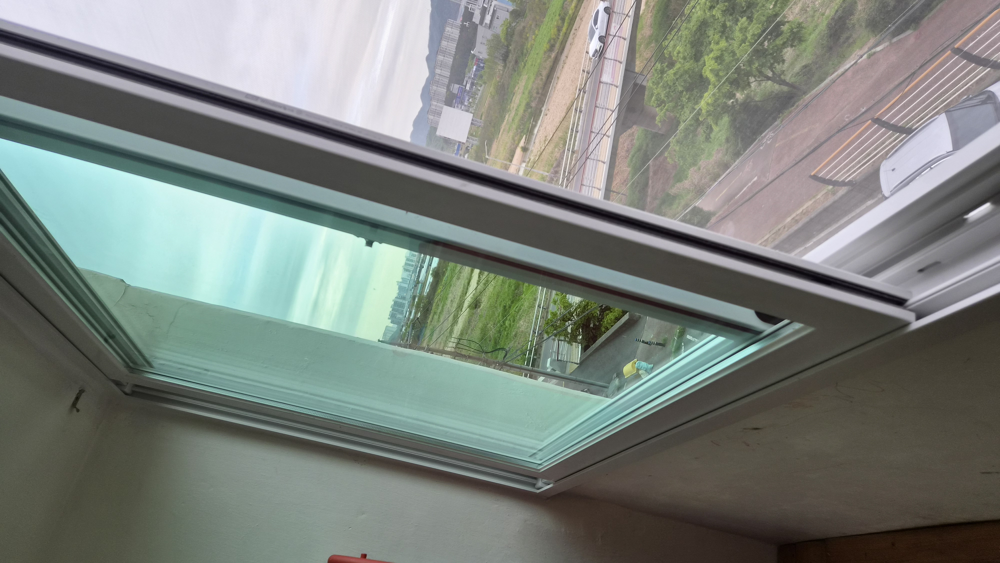
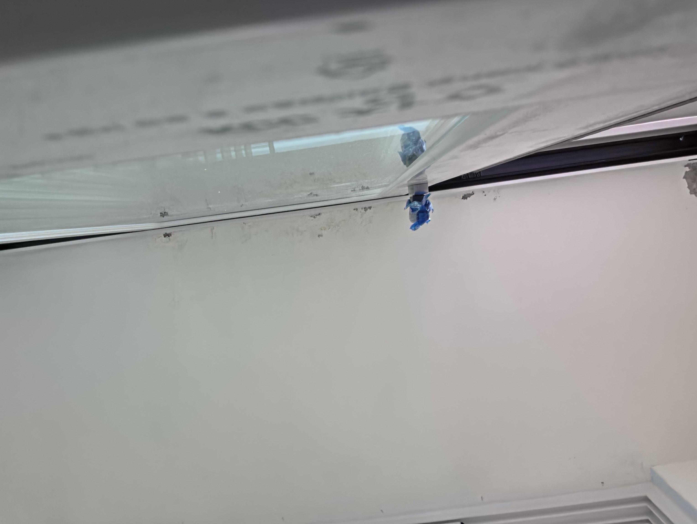
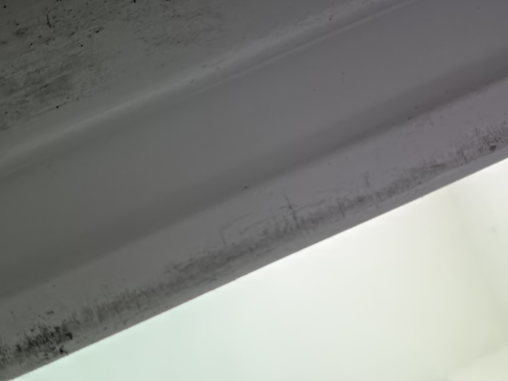
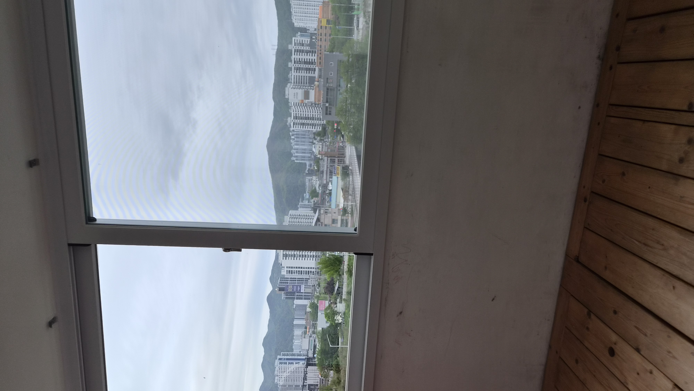
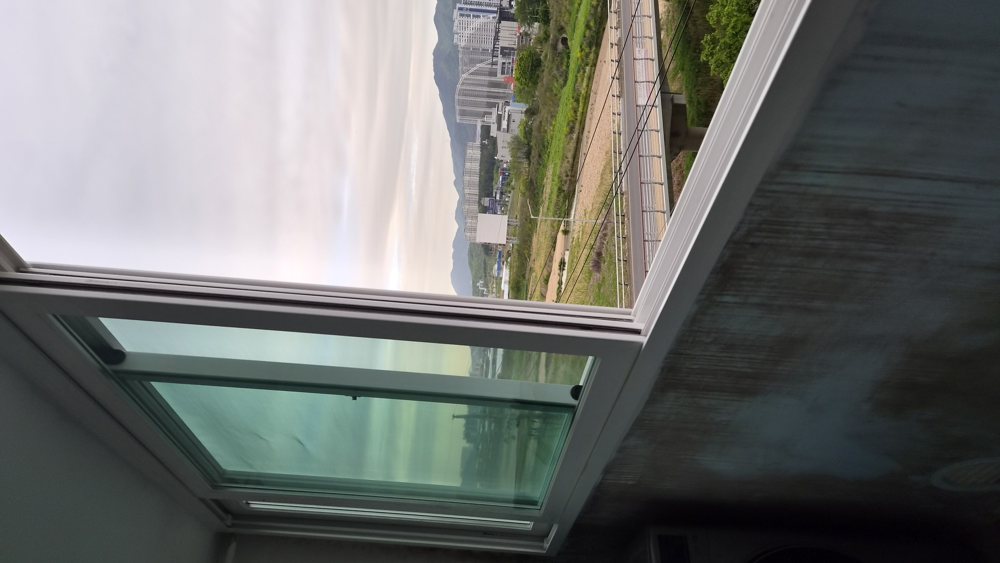
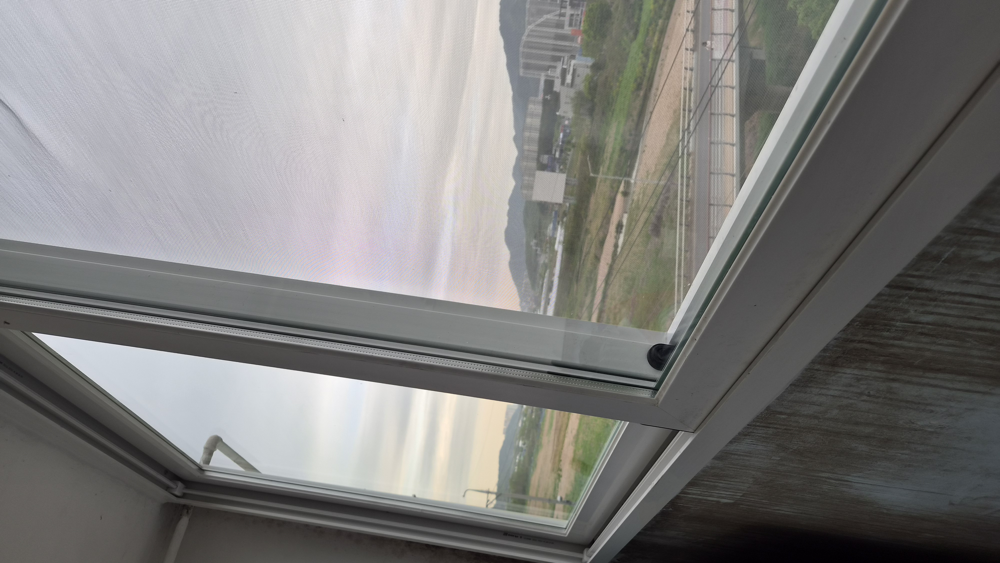
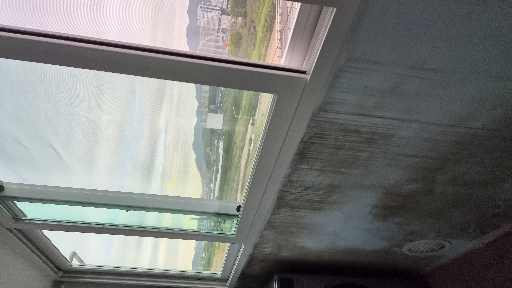
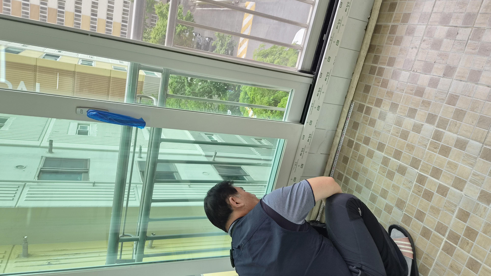

# 울산 북구 천곡동 원동 현대아파트 샤시 교체, 냉난방비 걱정 끝낸 실제 후기

30년 넘은 알루미늄 샤시를 전체 교체해 외풍과 소음, 냉난방비 걱정을 줄인 현장입니다. 창문이 아니라 집 전체의 공기 흐름을 바꾸는 작업이 얼마나 큰 차이를 만드는지 확인할 수 있었던 사례입니다.

## 30년 넘은 샤시는 이미 수명이 끝난 상태였습니다

창문 하나가 바뀌는 일이 아니라, 집의 공기 흐름이 바뀌는 작업이었습니다.

이번 현장은 울산 북구 천곡동 원동 현대아파트 101동이었습니다. 고객님께서는 겨울철 외풍, 여름철 열기, 바깥 소음 때문에 오랫동안 불편을 겪고 계셨습니다.

현장을 확인해보니 약 30년 이상 사용된 알루미늄 샤시는 틀 변형과 모헤어 마모, 틈새 벌어짐이 진행된 상태였습니다. 이 상태에서는 난방을 틀어도 춥고 에어컨을 틀어도 덥습니다. 사실상 냉난방비가 새는 구조였습니다.

### 부분 교체보다 전체 교체가 맞았습니다

샤시는 단순히 창틀만 바꾸는 일이 아닙니다. 집 전체 공기 흐름과 단열, 소음 차단을 함께 바꾸는 작업입니다.

이번 현장은 앞베란다, 뒷베란다, 중문, 방문 샤시까지 전체 교체로 진행했습니다. 부분 교체로는 같은 문제가 다시 생길 가능성이 크기 때문입니다.

### 보이지 않는 부분이 결과를 만듭니다

수평과 수직이 조금만 틀어져도 결로, 틀어짐, 누수 위험이 생길 수 있습니다.

그래서 폼 충진, 틈새 밀폐, 프레임 고정을 꼼꼼하게 확인했고, 외부 실리콘 마감까지 신경 써서 샤시 수명이 오래가도록 정리했습니다.

## 작업 순서

- 기존 알루미늄 샤시 철거

- 단열 샤시 프레임 설치

- 수평, 수직, 고정 상태 점검

- 폼 충진과 틈새 밀폐

- 외부 실리콘 마감 및 작동 확인

## 현장 사진으로 보는 전후 흐름

작업 전에는 오래된 샤시의 흔적이 분명했고, 작업 후에는 창이 묵직하게 닫히며 밀폐감이 확실해졌습니다.

## 현장 기록 이미지

시공 흐름이 잘 보이도록 대표 이미지를 정리했습니다.

## 작업 후 달라진 점

시공이 끝난 뒤 고객님께서는 창문이 닫힐 때의 밀폐감이 확실히 달라졌다고 말씀하셨습니다.

외풍이 줄고 소음이 덜 들리며, 집안 분위기까지 한결 정돈된 느낌으로 바뀌었습니다.

특히 샤시는 단순히 보기 좋은 공사가 아니라 냉난방비와 생활 만족도에 직접 영향을 주는 작업이기 때문에, 오래된 샤시는 늦추지 않고 점검하는 것이 좋습니다.

비슷한 고민이 있으시면 사진 한 장만 보내주셔도 상태를 먼저 안내드릴 수 있습니다.

## 울산 샤시 교체·생활집수리 상담

천곡동, 매곡동, 호계동, 화봉동, 송정동, 신천동을 비롯한 울산 전 지역 샤시 교체와 생활 집수리를 꼼꼼하게 도와드립니다.
