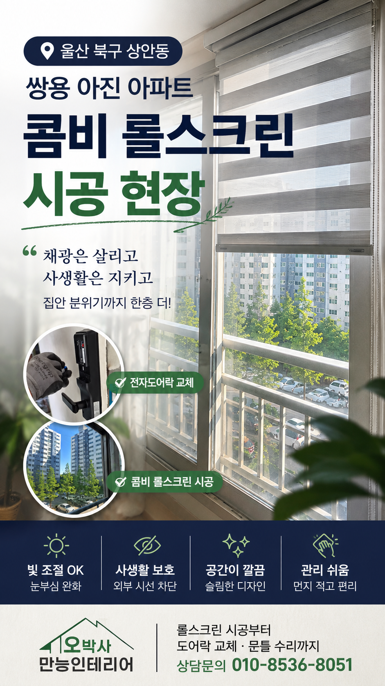
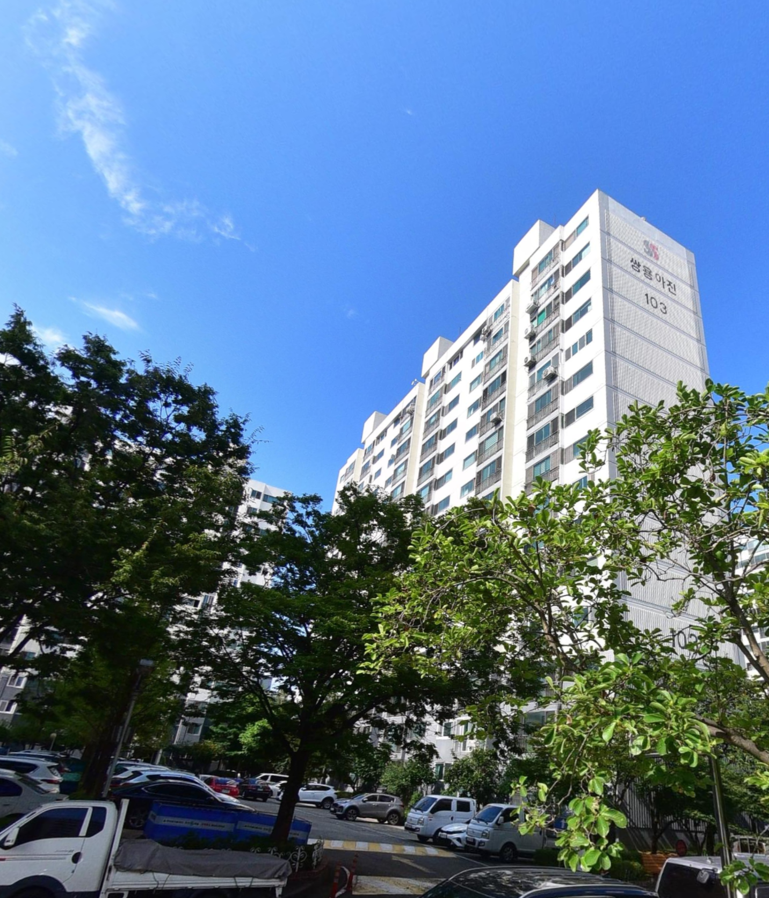
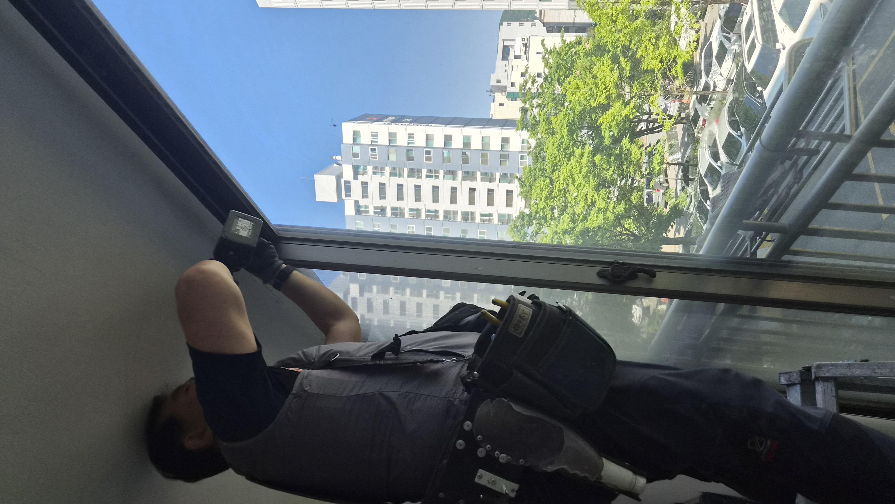
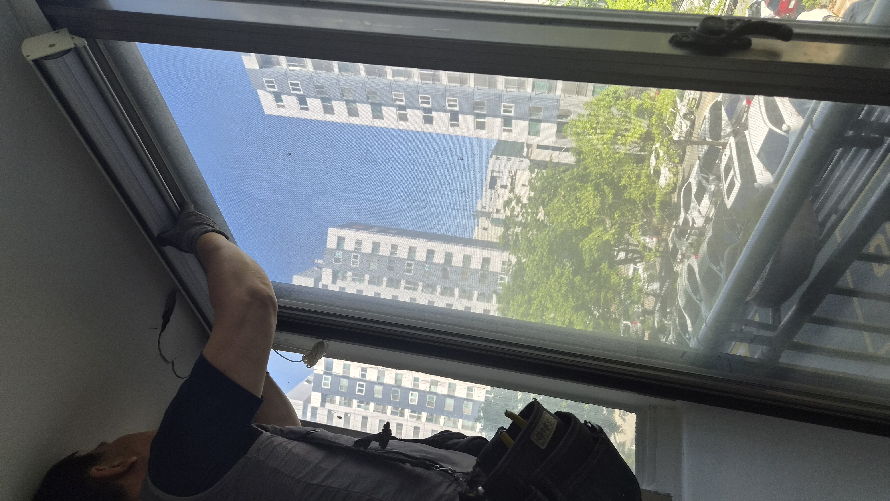
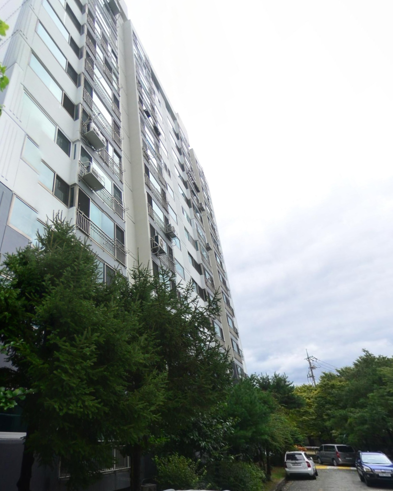
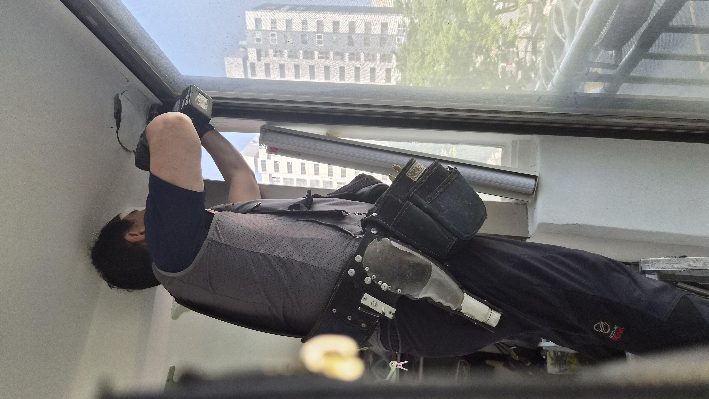
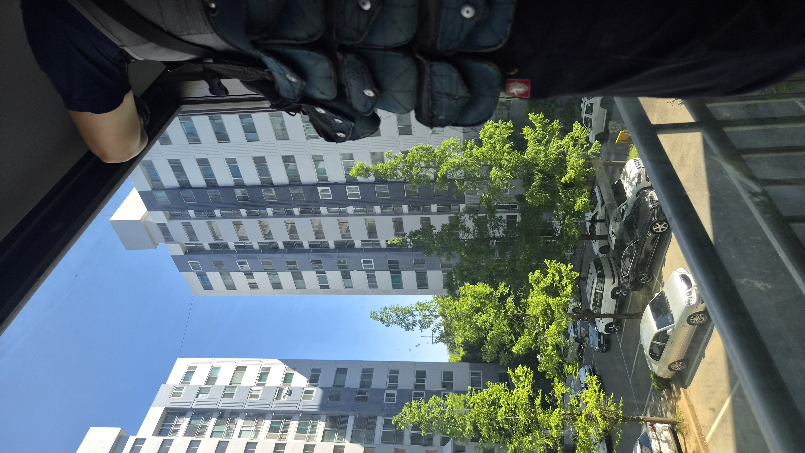
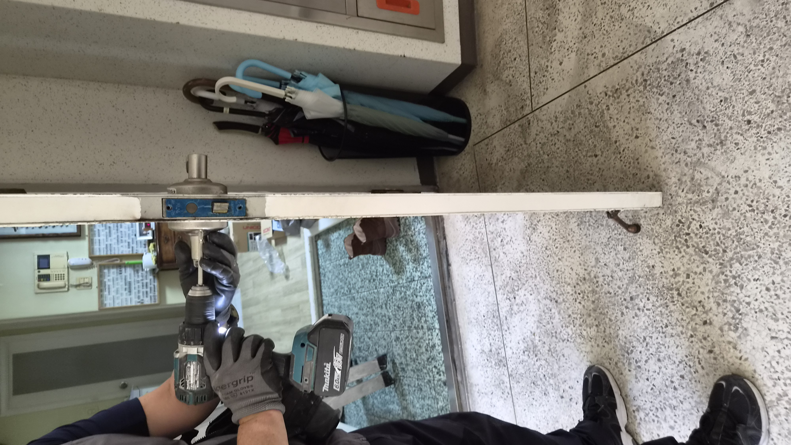

# 울산 북구 상안동 쌍용아진아파트 베란다 콤비 롤스크린 시공

햇빛이 강하고 베란다가 허전해 보인다는 문의를 받고 현장을 확인했습니다. 풍경은 살리고 눈부심은 줄일 수 있도록 콤비 롤스크린으로 정리하고, 문 상태까지 함께 점검한 현장입니다.

## 강한 햇빛이 들어오던 베란다를 먼저 살폈습니다

좋은 전망은 살리고, 눈부심은 줄이는 것이 이번 작업의 핵심이었습니다.

이번 현장은 울산 북구 상안동 쌍용아진1단지 아파트였습니다. 창밖 풍경이 참 좋고 채광도 뛰어난 집이었지만, 오후가 되면 햇빛이 강하게 들어와 베란다가 다소 허전하고 눈부셔 보이는 상황이었습니다.

고객님께서는 커튼을 먼저 떠올리셨지만, 현장을 함께 보니 무겁게 떨어지는 커튼보다 콤비 롤스크린이 공간과 더 잘 어울렸습니다. 시공 전에는 어떤 방식이 이 집의 분위기를 가장 편하게 만들어주는지부터 함께 판단했습니다.

### 콤비 롤스크린이 잘 맞는 집이 있습니다

이 집은 풍경이 살아 있는 대신 햇빛이 강한 편이라, 빛을 부드럽게 잡아주는 제품이 필요했습니다.

콤비 롤스크린은 원단이 겹치고 어긋나며 빛의 양을 조절할 수 있어, 블라인드처럼 실용적이면서도 롤스크린처럼 깔끔한 느낌을 줍니다.

### 생활 공간은 함께 봐야 더 편해집니다

롤스크린만 달고 끝내지 않았습니다. 시공 후 고객님이 매일 마주할 동선과 현관문 상태까지 함께 확인했습니다.

문이 뻑뻑하게 걸리고 소리가 난다고 하셔서, 방화문과 문틀 상태도 살펴본 뒤 미세하게 정리하고 도어락 교체 가능성까지 안내드렸습니다.

## 작업 순서

- 베란다 채광과 창문 방향 확인

- 가장 잘 맞는 원단과 폭 결정

- 콤비 롤스크린 설치

- 햇빛 차단과 개방감 균형 점검

- 현관문과 문틀 상태 추가 확인

## 현장 사진으로 보는 전후 흐름

작업 전에는 베란다 분위기가 다소 비어 보였고, 작업 후에는 풍경은 살고 햇빛은 한층 부드러워졌습니다.

## 현장 기록 이미지

시공 흐름이 한눈에 보이도록 대표 이미지를 정리했습니다.

## 작업 후 달라진 점

강한 햇빛이 부드럽게 걸러지면서 베란다 공간이 훨씬 안정감 있게 바뀌었습니다.

고객님께서는 창가가 훨씬 깔끔해졌고, 집 분위기가 한결 편안해졌다고 말씀하셨습니다.

또한 현관문의 뻑뻑함도 함께 정리해드려 생활 불편을 하나 더 줄일 수 있었습니다.

콤비 롤스크린은 단순히 햇빛을 막는 제품이 아니라, 집의 분위기를 정리하고 생활 만족도를 높여주는 실용적인 선택입니다. 비슷한 고민이 있으시면 사진 한 장만 보내주셔도 현장에 맞는 방향을 먼저 안내드릴 수 있습니다.

## 울산 베란다 롤스크린·생활집수리 상담

상안동, 매곡동, 호계동, 화봉동, 송정동, 신천동을 비롯한 울산 전 지역 생활 집수리와 인테리어 보수를 꼼꼼하게 도와드립니다.
