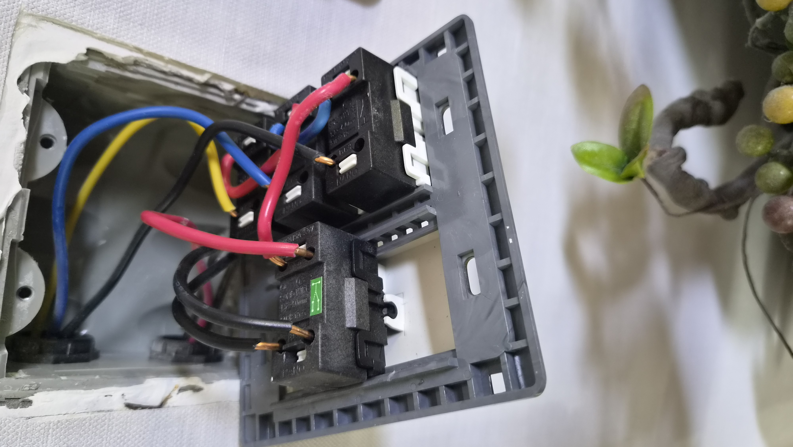
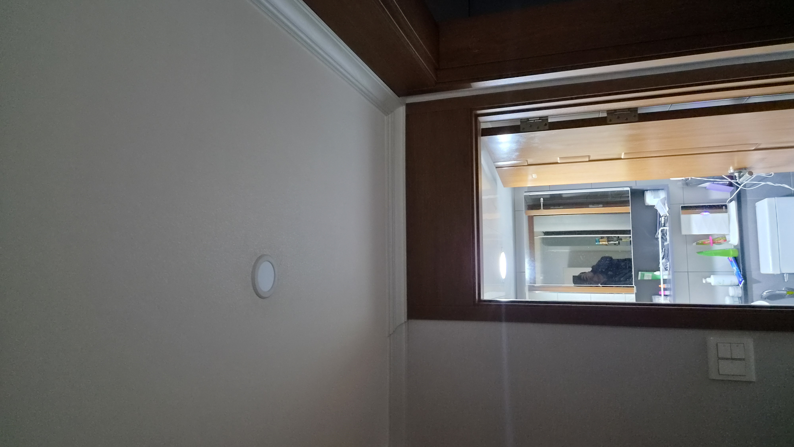
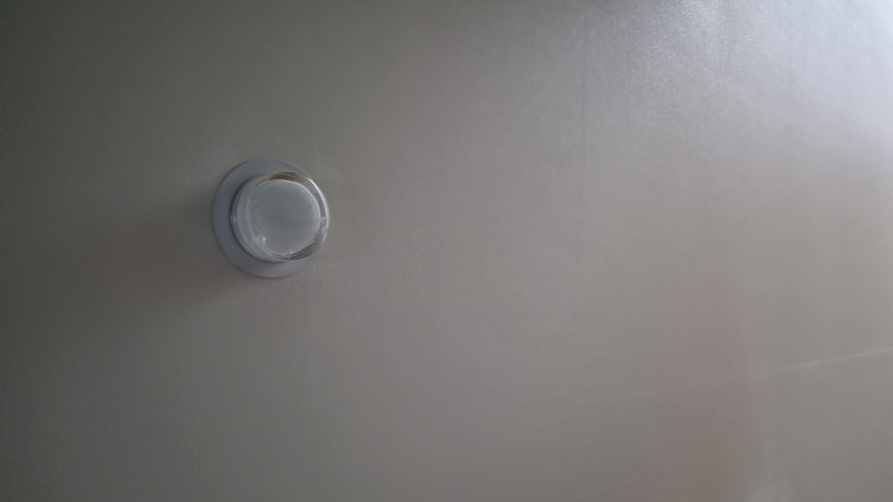
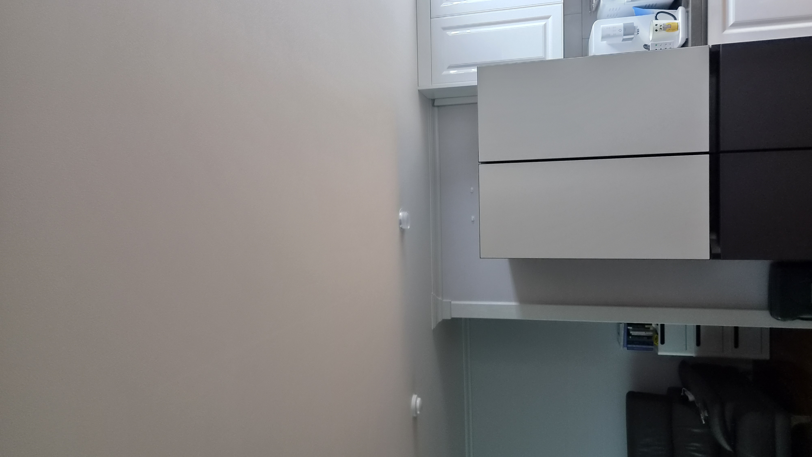
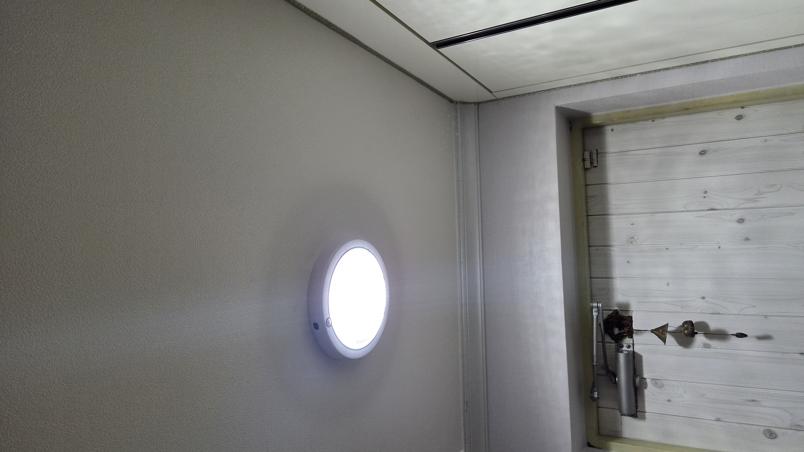
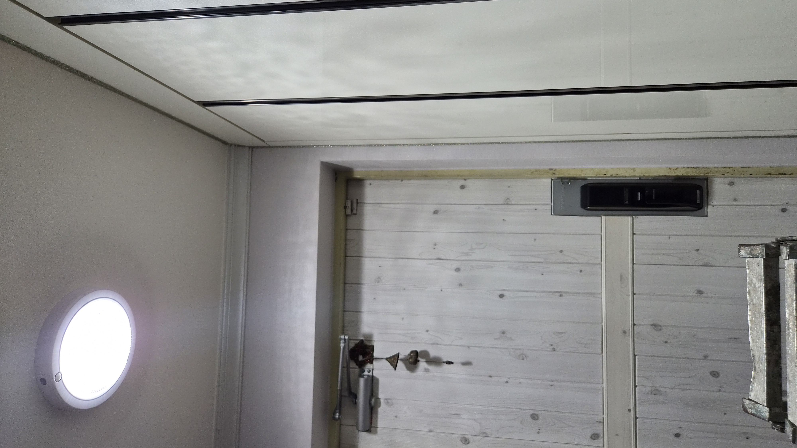
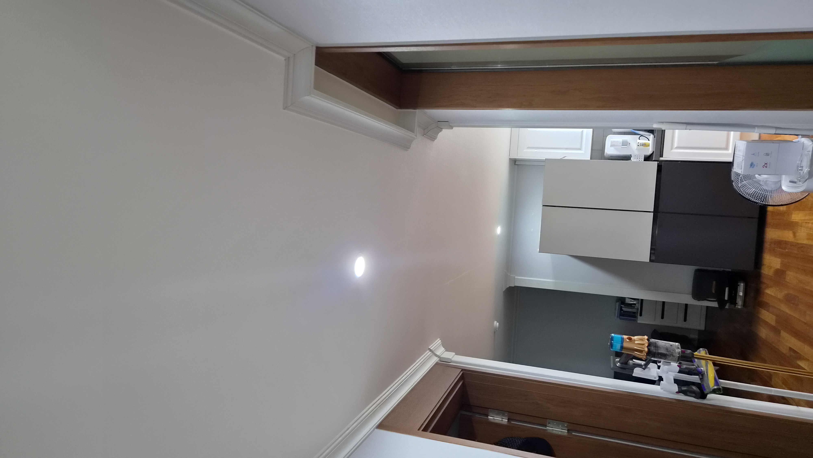
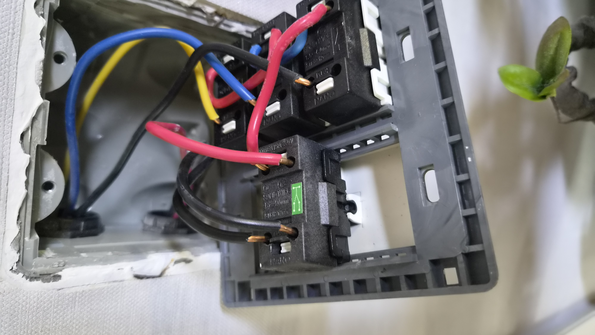

# 울산 북구 천곡동 삼성코아루 전등 깜빡임과 스위치 교체 해결

전등이 깜빡이고 스위치가 매끄럽게 눌리지 않는다는 문의를 받고 현장을 확인했습니다. 단순 전구 문제처럼 보였지만 스위치 접점 노후와 배선 체결 상태까지 함께 살펴야 했고, 노후 스위치를 교체하며 조명 상태를 정리한 현장입니다.

## 전등이 깜빡일 때는 전구만 의심하면 안 됩니다

집 안 조명이 흔들리기 시작하면 생각보다 생활이 불편해집니다.

이번 현장은 울산 북구 천곡동 삼성코아루 아파트였습니다. 고객님께서는 전등이 깜빡거리고 스위치가 눌릴 때마다 반응이 일정하지 않다고 말씀하셨습니다. 처음에는 단순 전구 문제처럼 느껴질 수 있지만, 실제로는 스위치 접점 노후와 배선 체결 상태를 함께 봐야 하는 경우가 많습니다.

불이 들어왔다 나갔다 하는 증상은 작은 불편처럼 보여도, 계속 사용하면 발열이나 스파크처럼 더 큰 문제로 이어질 수 있습니다. 그래서 현장에서는 먼저 왜 이런 증상이 생겼는지를 차근차근 확인했습니다.

### 접점이 약해지면 불이 불안정해집니다

오래 사용한 스위치는 외관이 멀쩡해 보여도 내부 접점이 마모되어 있을 수 있습니다.

이럴 때는 전등이 늦게 켜지거나, 켜졌다 꺼졌다 하거나, 스위치에서 미세한 이상 반응이 느껴질 수 있습니다. 현장에서 커버를 열어보니 배선 체결 상태를 다시 봐야 했고, 스위치 자체도 교체가 필요한 상태였습니다.

### 겉만 바꾸는 수리는 피했습니다

오박사만능인테리어는 단순히 보이는 부품만 바꾸지 않습니다.

문제가 생긴 이유를 확인하고, 다시 같은 증상이 반복되지 않도록 내부 체결과 결선 상태까지 함께 정리하는 것을 중요하게 생각합니다. 이번 작업도 노후 스위치를 안전하게 교체하고 조명 사용이 안정되도록 마감했습니다.

## 작업 순서

- 현장 도착 후 전등 깜빡임과 스위치 반응 상태 확인

- 스위치 커버 분리 후 접점과 배선 체결 상태 점검

- 노후 스위치 철거 및 주변 정리

- 새 스위치로 교체 후 결선 상태 재확인

- 점등 테스트와 마감 정리

## 현장 사진으로 보는 전후 상태

작업 전에는 스위치와 조명 흐름이 안정적이지 않았고, 교체 후에는 켜짐 반응이 한결 부드러워졌습니다.

## 현장 기록 이미지

촬영된 현장 사진을 바탕으로 전기수리 흐름이 한눈에 보이도록 정리했습니다.

## 작업 후 달라진 점

스위치를 누를 때의 반응이 안정적으로 바뀌었고, 전등도 더 자연스럽게 켜지고 꺼지도록 정리되었습니다.

고객님께서는 불이 깜빡거릴 때마다 신경 쓰였는데 이제는 마음이 놓인다고 말씀하셨습니다.

전등과 스위치는 매일 쓰는 만큼 작은 이상이 누적되기 쉽습니다. 반응이 늦어지거나 깜빡임이 반복된다면 초기에 점검하는 것이 가장 좋습니다.

조명 문제나 스위치 교체가 필요하시면 사진 한 장만 보내주셔도 현장 상태를 먼저 안내드릴 수 있습니다.

## 울산 전기수리·스위치교체 상담

천곡동, 매곡동, 호계동, 화봉동, 송정동, 신천동을 비롯한 울산 전 지역 전기수리와 조명 정리를 꼼꼼하게 도와드립니다.
