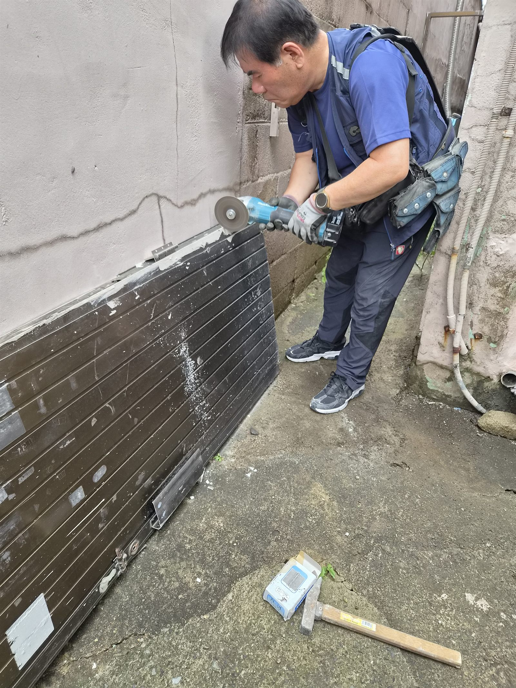
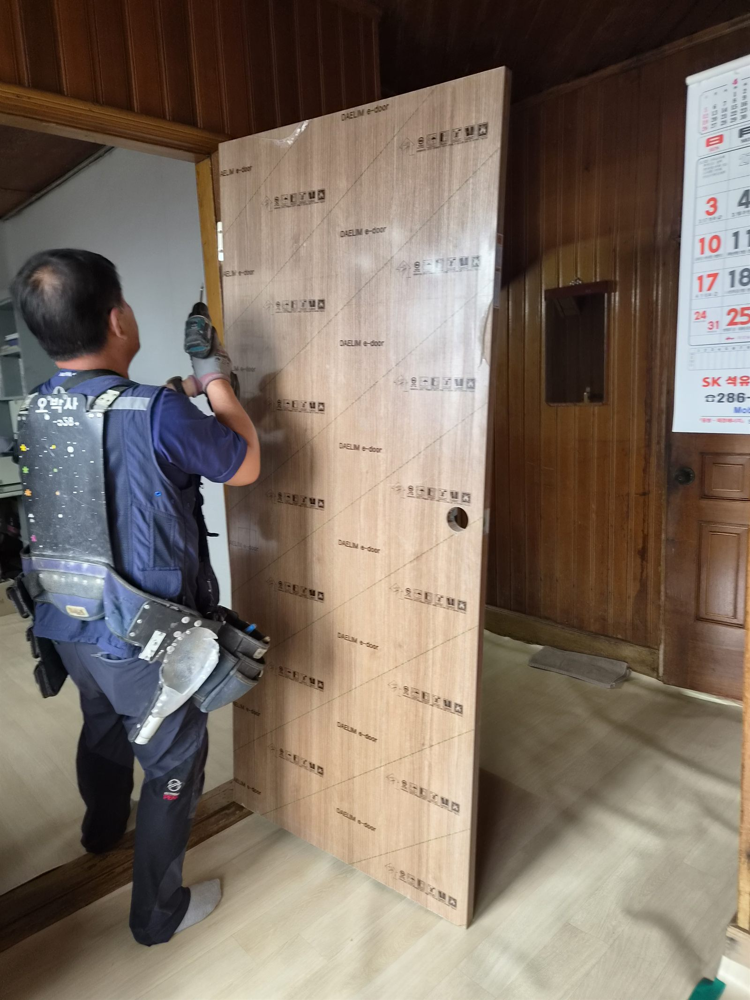
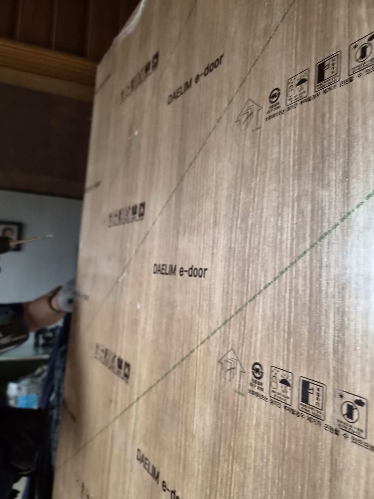
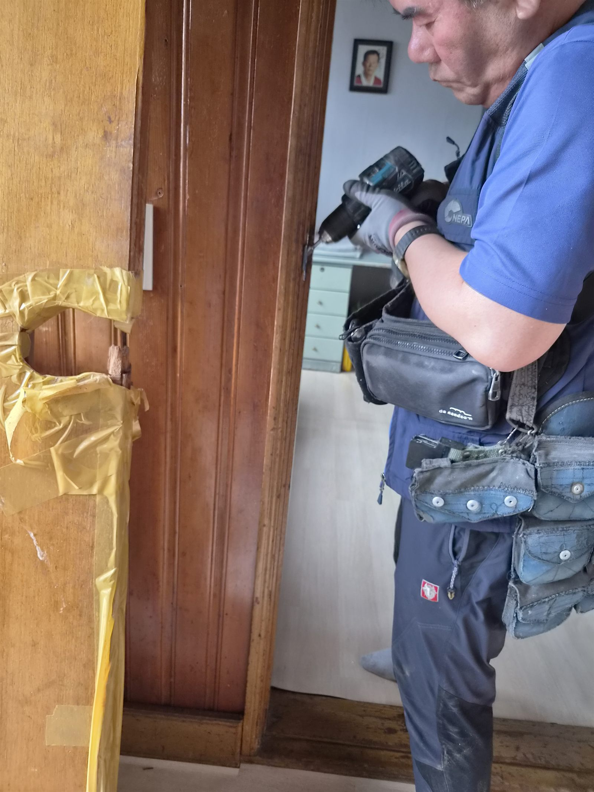
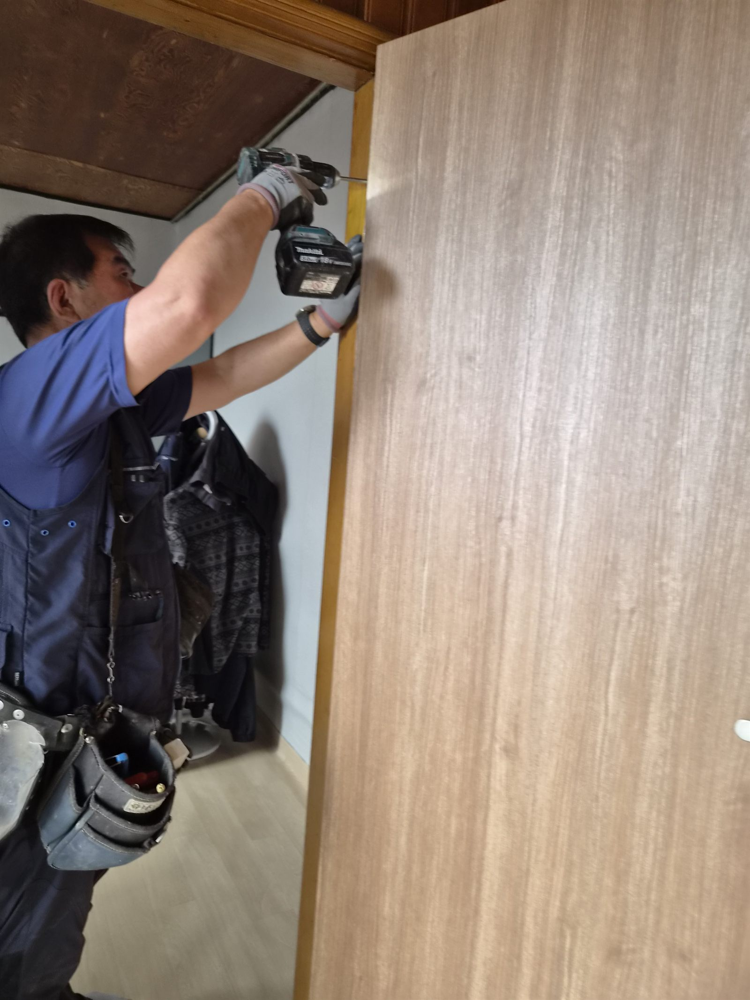
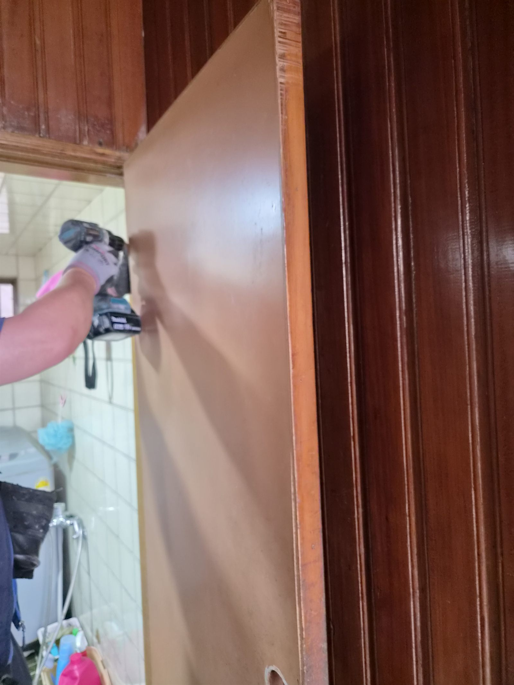
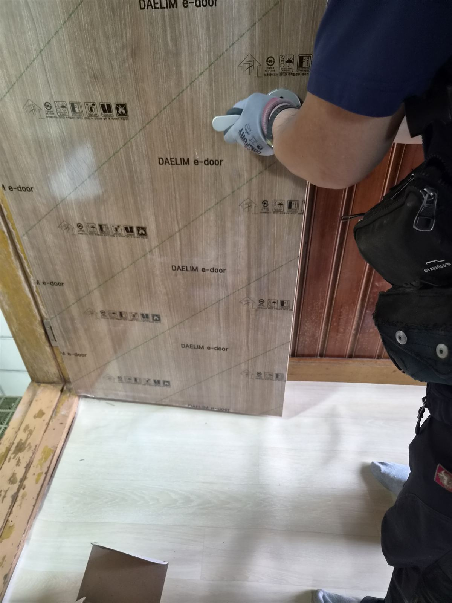

# 울산 중구 남외동 대문수리 후기, 내려앉은 문짝과 방문 틀어짐 해결 현장

오래된 집은 한 군데가 불편해지기 시작하면 그동안 참고 쓰던 문제들이 같이 드러납니다. 이번 현장도 처음에는 “대문이 내려앉았다”는 단순한 문의였지만, 도착해 보니 경첩 부식과 문틀 틀어짐, 실내 방문의 간섭까지 함께 확인해야 했던 집수리 현장이었습니다.

## 처음 문의는 단순했습니다

“대문이 내려앉았어요.”

이번 울산 중구 남외동 현장은 처음 문의만 들으면 단순한 대문 문제처럼 보였습니다. 하지만 오래된 주택은 늘 그렇듯, 한 곳이 틀어지기 시작하면 그동안 참고 넘어갔던 불편이 같이 드러납니다. 현장에 도착하니 대문만이 아니라 실내 방문까지 이미 무게와 세월을 함께 견디느라 많이 지쳐 있었습니다.

문을 닫을 때마다 소리가 크고, 힘을 줘야 겨우 닫히며, 바닥을 스치는 느낌까지 있었기 때문에 단순 조정이 아니라 구조 전체를 함께 봐야 하는 상황이었습니다.

### 가장 먼저 눈에 들어온 것은 심하게 녹슨 경첩이었습니다

겉으로는 문이 버티고 있는 것처럼 보여도, 안쪽 금속은 오래된 습기와 하중을 계속 받아 약해져 있었습니다. 경첩이 버티지 못하면 문짝은 자연스럽게 한쪽으로 기울고, 그 결과 문을 열 때 철이 갈리는 소리가 나고 닫을 때 바닥을 끌게 됩니다.

울산처럼 습도가 높은 지역에서는 철물 부식이 생각보다 빠르게 진행됩니다. 그래서 문 한 장만 바꾸는 식의 접근보다, 경첩 하중과 잠금 위치, 문틀 수평을 함께 보는 것이 중요합니다.

### 방문도 이미 오래 참고 있던 상태였습니다

집 안으로 들어가 보니 실내 방문도 문틀에 계속 걸리며 닫히지 않는 상태였습니다. 손잡이 주변에는 사용 흔적이 깊었고, 억지로 밀어 닫는 생활이 반복되고 있었습니다.

고객님께서는 “그냥 참고 썼어요”라고 웃으셨지만, 실제로는 매일 드나드는 동선이 불편해지면 집 안의 스트레스가 커집니다. 이런 문제는 생활 속에서 소리 없이 피로를 쌓게 만듭니다.

## 구조를 먼저 이해한 뒤, 현장에 맞게 다시 잡았습니다

이번 작업은 단순히 문짝만 갈아끼우는 방식이 아니었습니다. 오래된 주택은 아파트처럼 규격이 일정하지 않기 때문에, 벽과 문틀, 경첩, 잠금 위치가 모두 미세하게 어긋나 있을 수 있습니다.

그래서 먼저 문을 탈거해 하중이 어디로 쏠리는지 확인하고, 경첩과 브라켓 상태를 살펴본 뒤 현장 구조에 맞게 다시 세팅했습니다. 필요한 부분은 절단으로 맞추고, 피스 위치와 경첩 위치를 다시 잡아 문짝 중심을 회복시켰습니다.

## 문 하나 편해지면 집 분위기까지 달라집니다

작업 후에는 문이 바닥에 끌리지 않고 부드럽게 닫히는 상태로 정리했습니다. 고객님과 함께 여러 번 열고 닫아보며 걸리는 느낌이 사라졌는지, 잠금이 안정적으로 맞는지 확인했습니다.

억지로 밀지 않아도 조용히 닫히는 문은 생각보다 큰 차이를 만듭니다. 집에 들어올 때마다 들리던 불편한 소리가 사라지면, 생활의 긴장감도 같이 내려갑니다.

오래된 집일수록 “조금만 더 버티자”는 마음으로 참고 쓰는 경우가 많지만, 사실 그런 시점이 바로 점검 신호입니다. 문이 한쪽으로 기울거나 손잡이 위치가 맞지 않으면 더 큰 수리로 번지기 전에 초기에 잡는 것이 좋습니다.

## 대문수리와 방문수리, 결국 기본이 오래 갑니다

현관문이든 방문이든 기본은 같습니다. 무겁게 기울어진 문을 억지로 쓰지 않게 하고, 경첩과 문틀의 균형을 다시 맞춰 주는 일입니다. 이번 현장처럼 경첩 부식과 문틀 틀어짐이 함께 온 경우에는 겉만 맞추면 다시 문제가 생기기 쉽습니다.

울산 중구 남외동을 비롯해 복산동, 우정동, 태화동, 성안동 등 울산 전 지역에서 문짝 파손, 현관문 처짐, 경첩 교체, 방문 수리, 잠금장치 문제까지 현장 경험 중심으로 정리해드리고 있습니다.

## 이런 증상이 보이면 초기에 점검하세요

- 문이 바닥을 끌거나 닫을 때 소리가 큽니다.

- 문이 한쪽으로 기울어져 보입니다.

- 문틀에 계속 걸리면서 힘을 줘야 닫힙니다.

- 손잡이 위치가 맞지 않거나 잠금이 불안정합니다.

- 경첩 주변에 녹이 보이기 시작합니다.

## 울산 대문수리와 방문수리 상담

문이 끌리거나 덜컹거린다면 더 커지기 전에 원인부터 확인해보세요.
