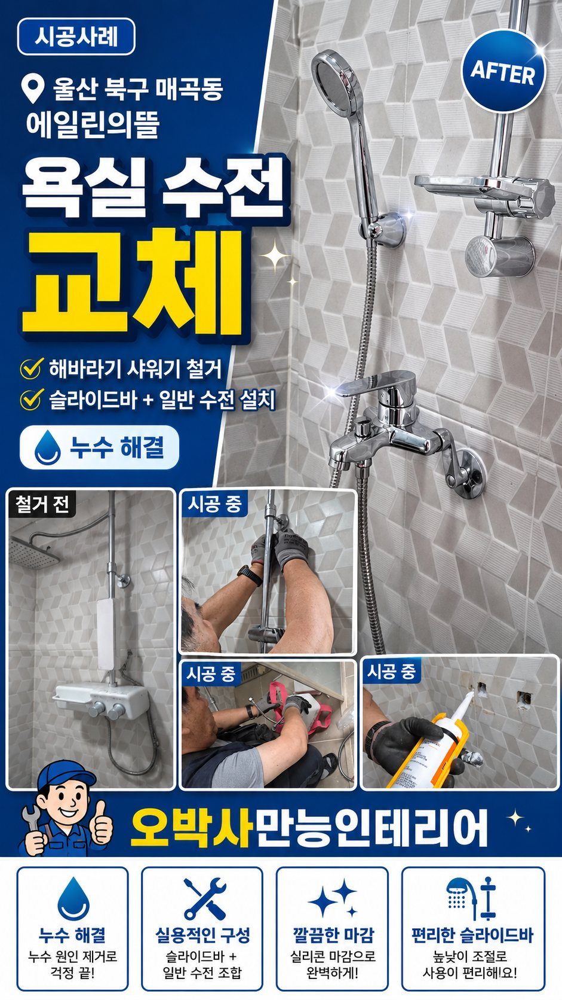
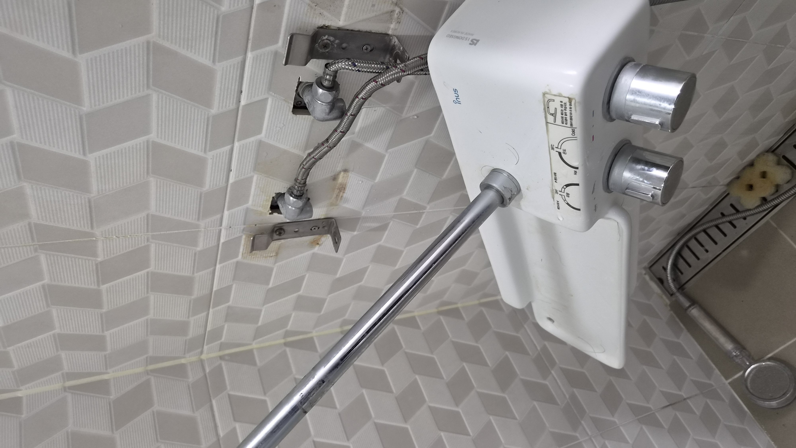
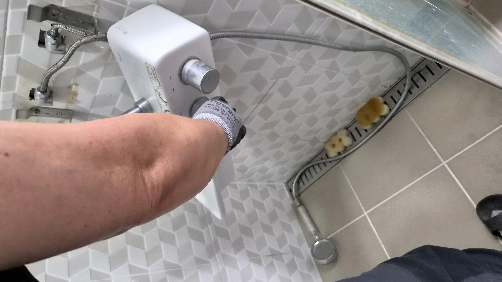
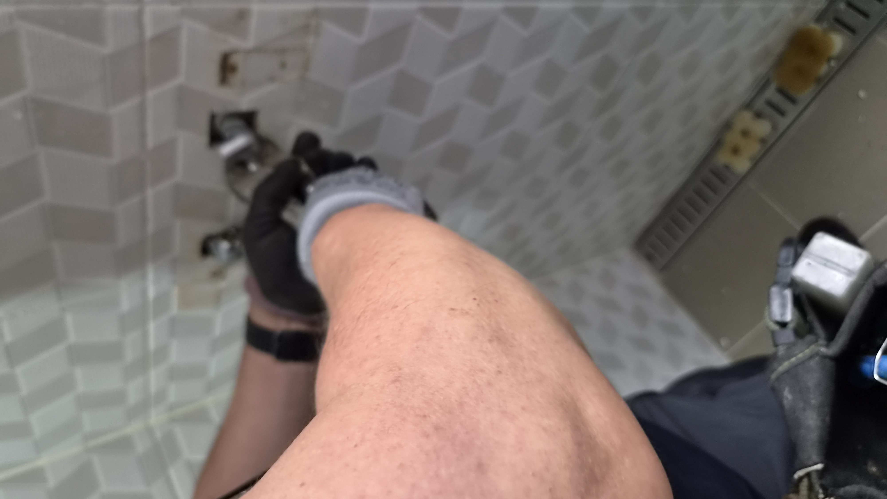
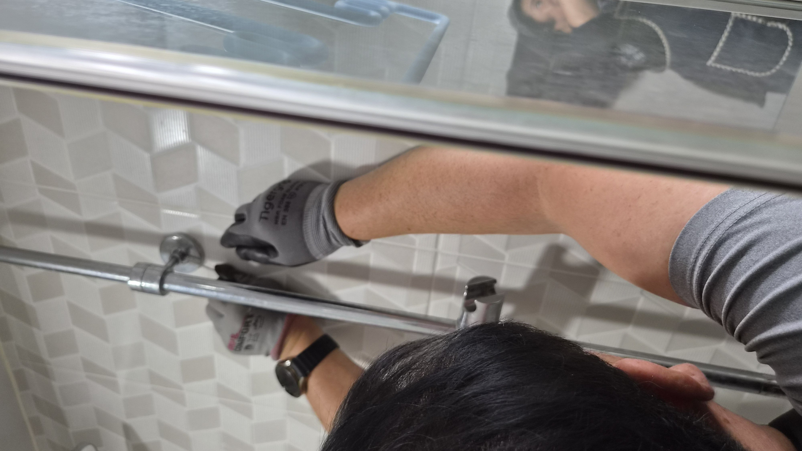
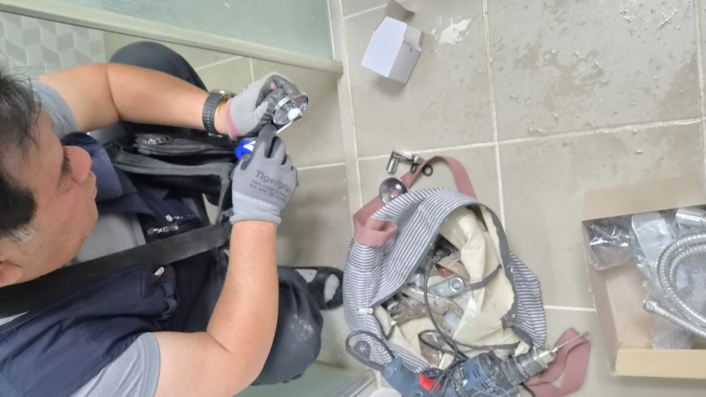
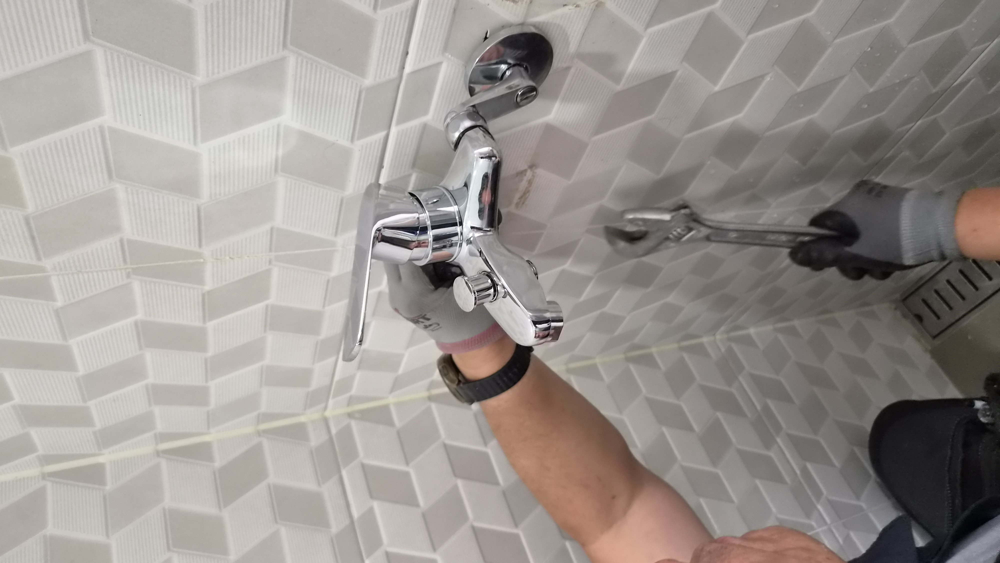

# 울산 북구 매곡동 에일린의뜰 욕실 수전 누수 해바라기 샤워기 철거 후 일반 수전 교체

욕실 수전에서 누수가 보이고 해바라기 샤워기 사용이 불편하다는 문의를 받았습니다. 현장에서 확인 후 해바라기 샤워기를 철거하고 일반 수전과 슬라이드바로 바꿔 관리와 사용성을 함께 정리한 현장입니다.

## 고객님이 먼저 알려주신 건 누수와 불편함이었습니다

욕실은 매일 쓰는 공간이라 작은 불편도 금방 눈에 띕니다.

이번 현장은 울산 북구 매곡동 에일린의뜰 아파트였습니다. 고객님께서는 욕실 수전 주변에서 물이 새는 느낌이 있고, 해바라기 샤워기는 높이 조절이 불편해 평소에도 사용하기 번거롭다고 말씀하셨습니다.

샤워기를 자주 쓰는 집일수록 누수와 사용 불편이 같이 생기면 관리 스트레스가 커집니다. 현장에서는 먼저 물이 어디서 새는지, 그리고 어떤 방식으로 바꾸면 일상 사용이 편해지는지부터 확인했습니다.

### 누수는 연결부와 노후 상태를 함께 봐야 합니다

욕실 수전은 겉으로 멀쩡해 보여도 연결 부위나 내부 패킹이 노후되면 물이 조금씩 새기 시작합니다.

해바라기 샤워기는 크고 보기 좋지만, 사용자가 느끼는 실용성은 집마다 다릅니다. 이 현장에서는 수전 주변과 고정 상태를 꼼꼼히 확인한 뒤 전체 교체 방향이 맞다고 판단했습니다.

### 철거 후 더 관리하기 쉬운 방식으로 정리했습니다

오박사만능인테리어는 보기만 좋은 구조보다, 오래 쓰기 편한 구조를 우선합니다.

이번 작업에서는 해바라기 샤워기를 철거하고 일반 수전으로 바꾸면서 슬라이드바까지 함께 설치해 높이 조절과 유지관리가 쉬워지도록 정리했습니다.

## 작업 순서

- 현장 도착 후 누수 지점과 수전 상태 확인

- 해바라기 샤워기와 기존 부속 철거

- 배관 연결부와 마감 상태 점검

- 일반 수전과 슬라이드바 설치

- 물샘 여부와 작동 상태 테스트

## 현장 사진으로 보는 전후 상태

작업 전에는 누수와 함께 고정 상태가 불안정했고, 작업 후에는 일반 수전으로 정리되면서 욕실 사용이 한결 단순해졌습니다.

## 웹툰으로 보는 교체 흐름

해바라기 샤워기 철거부터 일반 수전 설치, 마감 확인까지 한눈에 볼 수 있도록 정리했습니다.

## 작업 후 달라진 점

교체 후에는 샤워기 높이 조절이 더 쉬워졌고, 수전 구조도 단순해져 청소와 관리가 한결 편해졌습니다.

고객님께서는 욕실이 더 깔끔해 보이고, 앞으로는 부품 교체나 점검도 훨씬 수월하겠다고 말씀하셨습니다.

욕실 수전은 한번 손보면 오랜 기간 쓰는 부위이기 때문에, 처음부터 관리하기 쉬운 방식으로 정리하는 것이 중요합니다.

해바라기 샤워기 사용이 불편하거나 수전 주변에서 물이 새는 느낌이 있다면, 사진 한 장만 보내주셔도 상태를 먼저 안내드릴 수 있습니다.

## 울산 욕실수리·수전교체 상담

매곡동, 호계동, 화봉동, 송정동, 신천동을 비롯한 울산 전 지역 욕실수리와 수전교체를 꼼꼼하게 도와드립니다.
