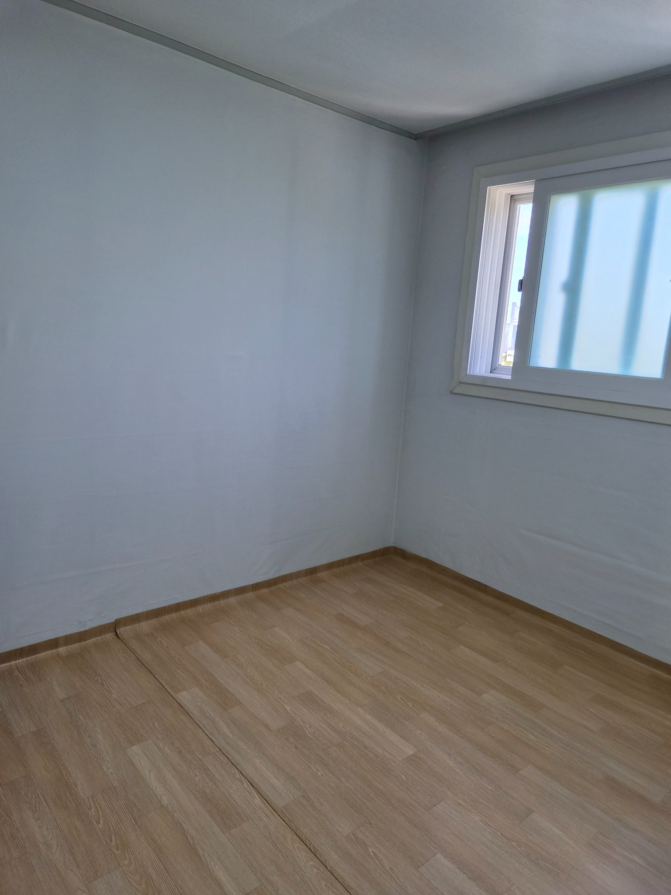
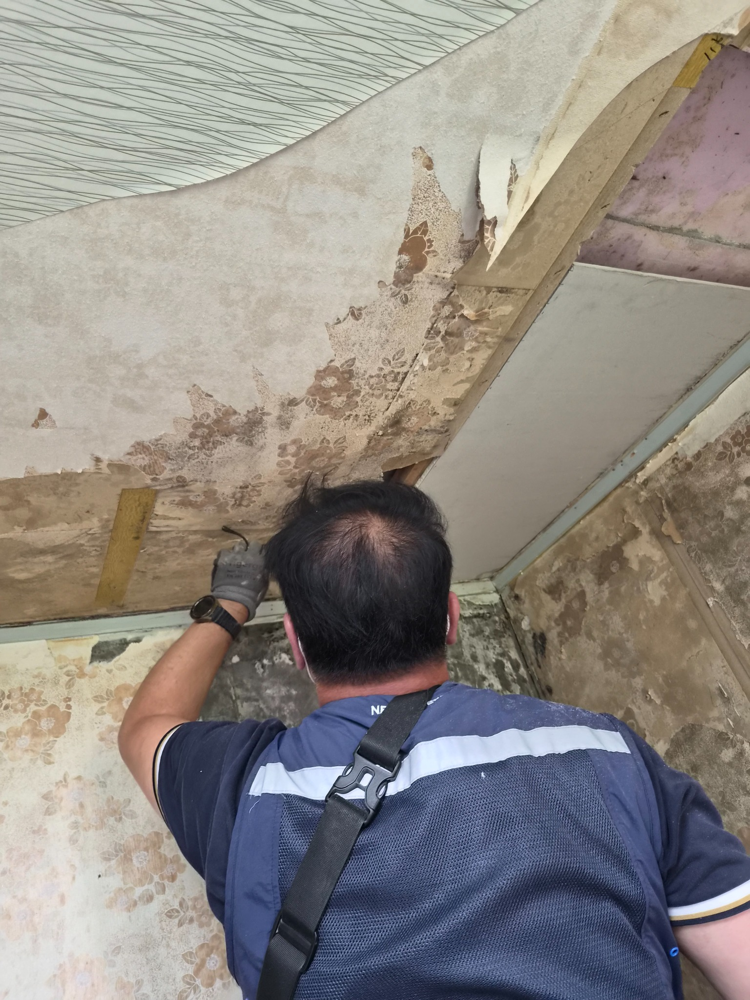
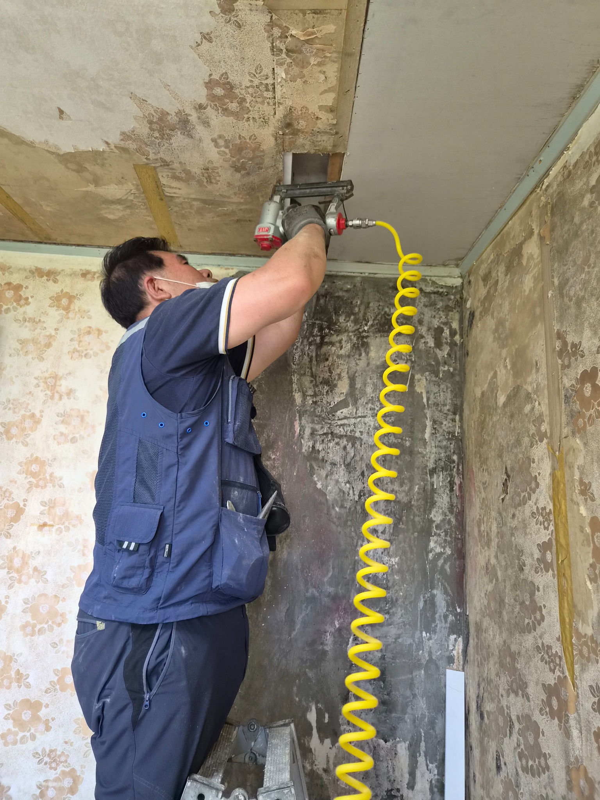
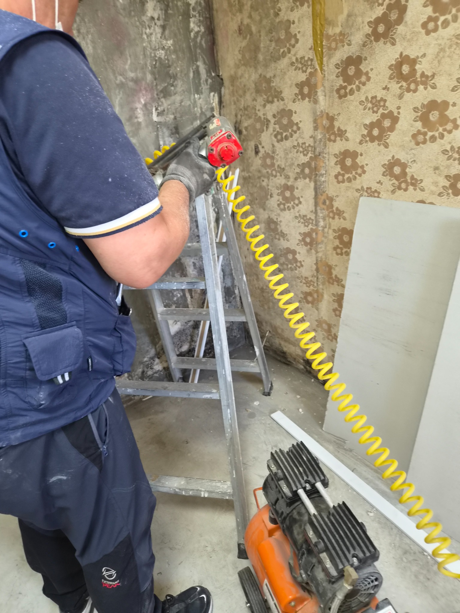
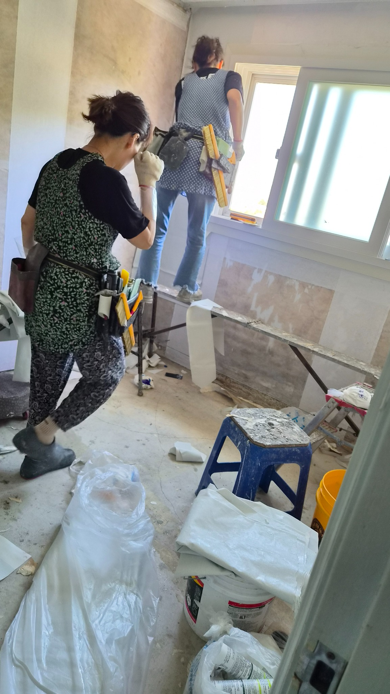
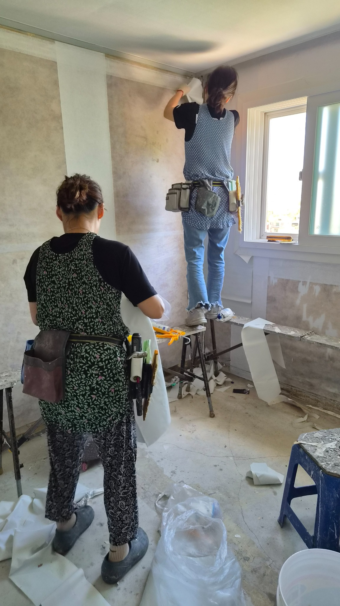
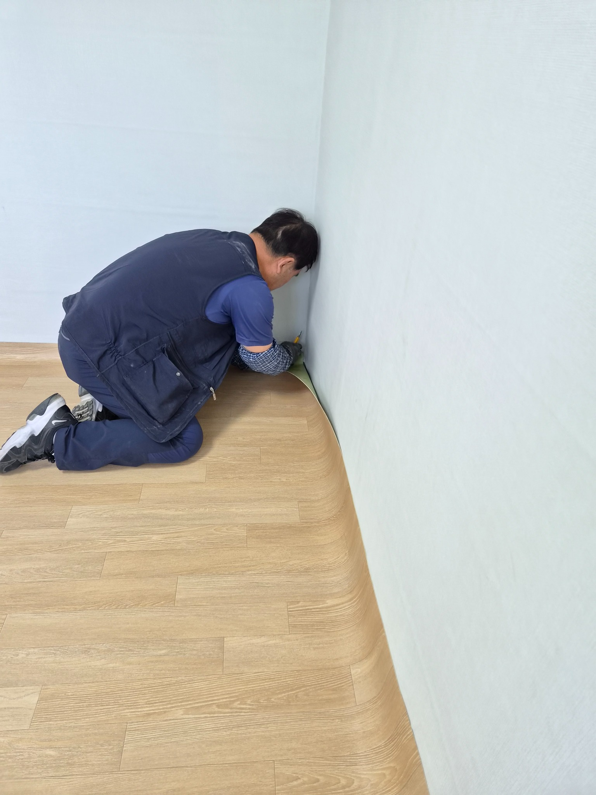
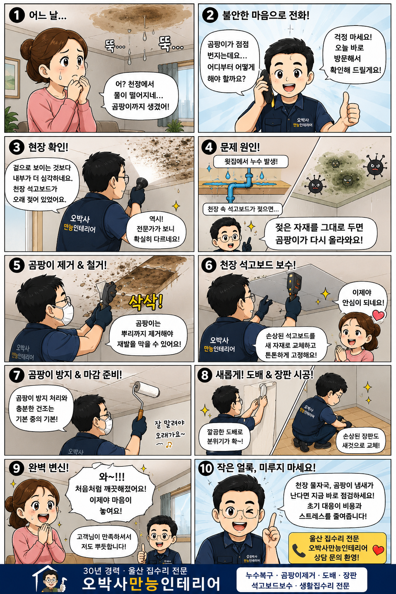

# 울산 중산동 백산그린타운아파트 천장 누수 곰팡이 복구

윗집 누수로 천장과 벽면에 곰팡이가 생기고, 장판까지 영향을 받은 현장을 곰팡이 제거, 천장 석고보드 보수, 도배와 장판 시공으로 차근차근 복구했습니다.

## 천장 물자국 하나가 시작이었습니다

집은 하루의 피로를 내려놓는 공간입니다.

그런데 어느 날 천장에 물자국이 생기고 곰팡이 냄새까지 올라오기 시작하면, 고개를 들 때마다 마음이 무거워집니다.

이번 현장은 울산 북구 중산동 백산그린타운아파트 101동에서 진행한 천장 누수 복구 사례입니다.

윗집 누수로 천장 석고보드와 벽면에 곰팡이가 발생했고, 습기가 바닥 장판까지 영향을 준 상태였습니다.

### 현장 확인 결과

겉으로는 작은 얼룩처럼 보였지만 내부 상태는 달랐습니다.

천장 석고보드가 오랜 시간 습기를 머금고 있었고, 곰팡이도 여러 곳에서 확인되었습니다.

바닥 장판 역시 습기의 영향을 받아 들뜸이 시작되고 있었습니다.

### 왜 다시 생길까

젖은 자재를 그대로 두고 벽지만 새로 붙이면 곰팡이는 다시 올라올 수 있습니다.

누수 복구는 빨리 덮는 작업이 아니라, 젖은 부분을 정확히 확인하고 정리하는 작업입니다.

## 곰팡이 제거부터 도배 장판까지

먼저 곰팡이가 발생한 부분을 제거했습니다.

이후 천장 내부 상태를 점검하며 손상된 석고보드 부분을 보수했습니다.

충분한 건조 상태를 확인한 뒤 곰팡이 재발을 줄이기 위한 기본 처리를 진행했습니다.

그 다음 천장면을 정리하고 도배 시공을 진행했습니다.

마지막으로 습기의 영향을 받은 바닥 장판까지 새롭게 시공하며 작업을 마무리했습니다.

## 작업 후 달라진 집의 분위기

공사가 끝난 뒤 가장 크게 달라진 것은 집 안 분위기였습니다.

천장에 남아 있던 물자국이 사라지고, 곰팡이 흔적도 깨끗하게 정리되었습니다.

새 도배와 장판이 시공되면서 공간 전체가 밝고 단정해졌습니다.

집수리는 단순히 낡은 부분을 고치는 일이 아닙니다.

그 공간에서 살아가는 사람의 걱정을 덜어내는 일입니다.

## 10컷 웹툰으로 보는 누수 복구 이야기

천장 물자국을 발견한 순간부터 오박사만능인테리어가 현장을 확인하고 복구하는 흐름을 쉽게 볼 수 있도록 웹툰 형태로 정리했습니다.

## 아파트 윗집 누수 발생 시 꼭 확인하세요

- 먼저 관리사무소에 상황을 알리고 원인 확인을 요청합니다.

- 공용 배관 문제인지, 위층 세대 문제인지 구분해야 합니다.

- 천장 얼룩, 곰팡이, 벽지 변색, 장판 손상은 사진으로 기록해 둡니다.

- 도배 전에 젖은 석고보드와 내부 상태를 먼저 확인합니다.

- 작은 물자국이라도 냄새와 곰팡이가 함께 있다면 빠른 점검이 필요합니다.

## 울산 누수 복구는 정확한 진단이 먼저입니다

천장 물자국, 곰팡이 냄새, 장판 들뜸이 보인다면 너무 늦기 전에 확인해 보세요.
