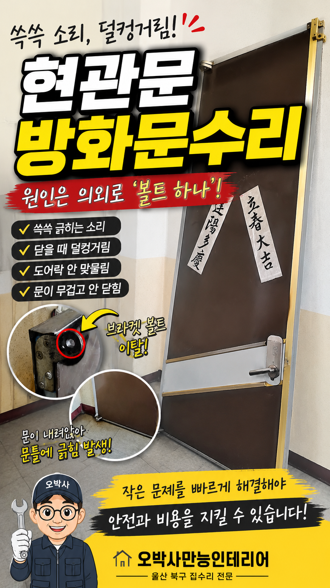
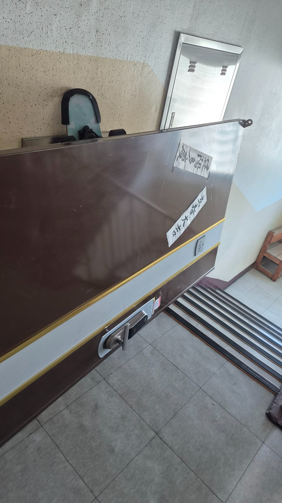
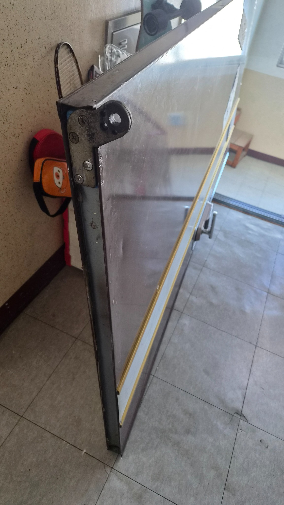
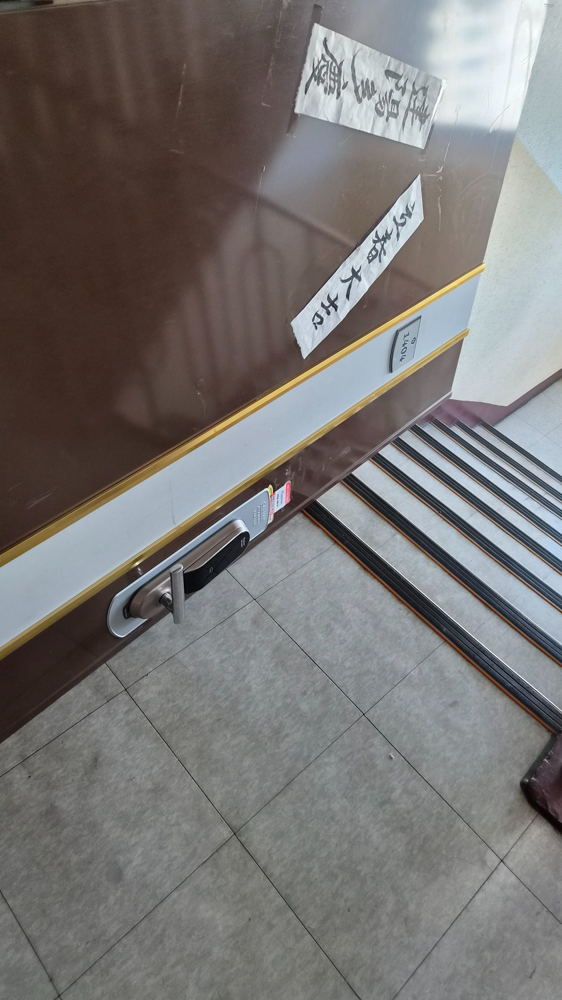
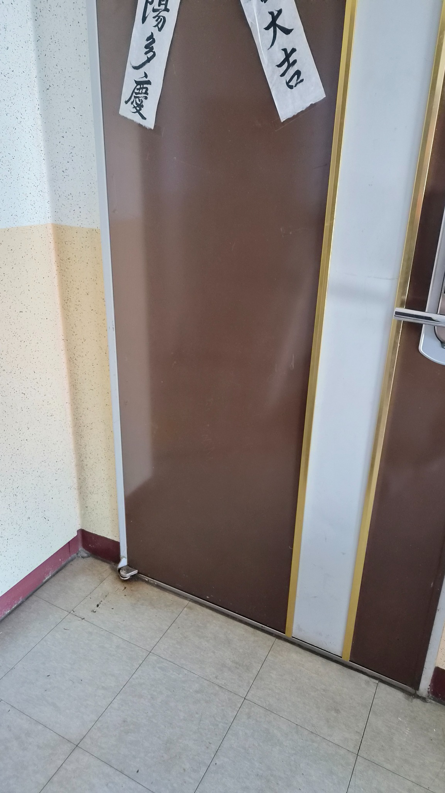
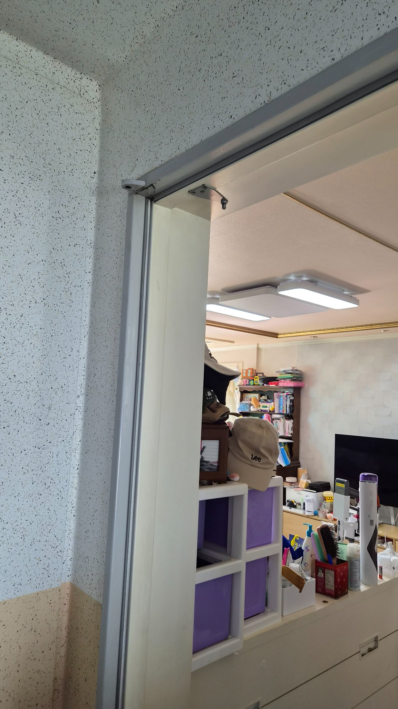
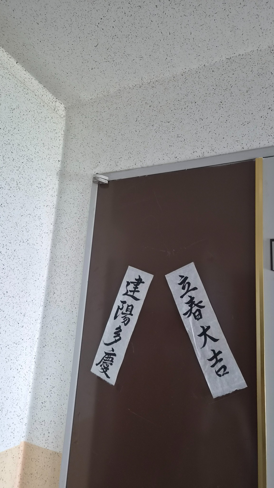
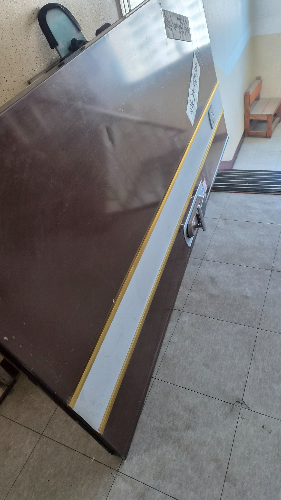
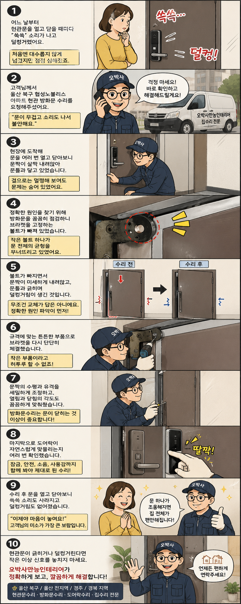

# 울산 북구 협성노블리스 방화문수리 끌리는 소리와 덜컹거림 해결

현관문을 열고 닫을 때마다 들리던 긁힘 소리와 덜컹거림. 원인은 의외로 작은 브라켓 볼트 이탈이었습니다. 방화문 탈거, 체결 보강, 수평 조정, 도어락 확인까지 실제 작업 흐름을 정리했습니다.

## 현관문은 작은 소리로 먼저 알려줍니다

집은 말이 없지만, 문은 소리로 먼저 신호를 보냅니다.

울산 북구 협성노블리스 아파트 고객님께서는 현관문을 닫을 때마다 끌리면서 긁히는 소리가 나고, 마지막에는 덜컹거리며 무겁게 닫힌다고 연락을 주셨습니다.

처음에는 오래된 문이라 그런가 보다 하고 넘길 수 있지만, 방화문은 무게가 있는 구조라 작은 틀어짐도 안전과 사용감에 영향을 줍니다.

### 겉보기에는 멀쩡했습니다

문 표면만 보면 큰 문제가 없어 보였습니다.

하지만 실제로 열고 닫아보니 문짝이 살짝 내려앉아 문틀과 마찰이 생기는 상태였습니다.

도어락도 예전처럼 자연스럽게 맞물리지 않아 전체 균형 점검이 필요했습니다.

### 문제는 브라켓 볼트였습니다

방화문을 안전하게 탈거한 뒤 힌지와 브라켓 주변을 확인했습니다.

문을 지탱해야 할 핵심 볼트가 빠져 있었고, 그 영향으로 문짝 중심이 틀어진 상태였습니다.

볼트 하나가 빠졌을 뿐인데 무거운 방화문 전체가 내려앉은 것입니다.

## 교체보다 먼저 정확한 원인을 봤습니다

이런 현장에서 무조건 문짝 전체 교체부터 이야기하면 고객 부담이 커집니다.

오박사만능인테리어는 먼저 원인을 확인하고, 수리로 안정화할 수 있는지부터 판단합니다.

이번 현장은 규격에 맞는 부품으로 브라켓을 다시 체결하고, 문짝 수평과 유격을 조정하면 충분히 해결 가능한 상태였습니다.

## 수리 후 문은 다시 조용해졌습니다

체결이 끝난 뒤 문짝 위치를 다시 잡고 수평과 유격을 세밀하게 맞췄습니다.

고객님과 함께 여러 번 열고 닫아보며 끌리는 긁히는 소리, 덜컹거림, 도어락 잠김 상태를 확인했습니다.

작업 후에는 문이 한결 부드럽게 닫히고, 도어락도 제 위치에서 자연스럽게 맞물렸습니다.

문 하나가 조용해졌을 뿐인데 집 안의 불안감도 같이 내려앉았습니다.

## 10컷 웹툰으로 보는 방화문수리 흐름

고객님이 느낀 불편부터 원인 점검, 브라켓 보강, 도어락 확인까지 고객이 쉽게 이해할 수 있도록 세로형 웹툰으로 정리했습니다.

## 이런 증상이 있으면 초기에 점검하세요

- 문을 닫을 때 끌리면서 긁히는 소리가 납니다.

- 현관문이 예전보다 무겁게 움직입니다.

- 닫을 때 덜컹거리거나 문틀에 부딪힙니다.

- 도어락이 한 번에 잠기지 않습니다.

- 문틀이나 문 하부에 새 긁힘 자국이 보입니다.

## 울산 방화문수리, 작은 소리부터 확인하세요

현관문이 긁히거나 덜컹거린다면 더 커지기 전에 원인부터 확인해보세요.
