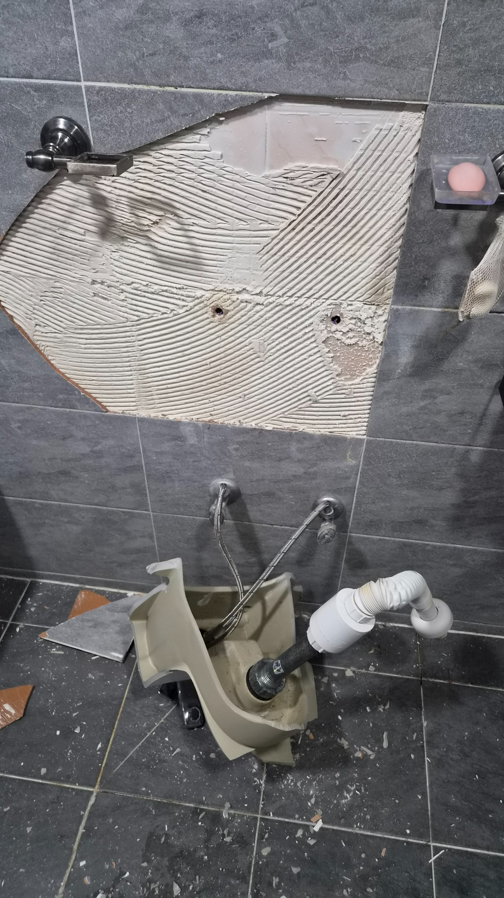
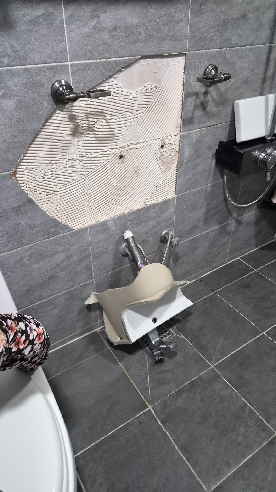
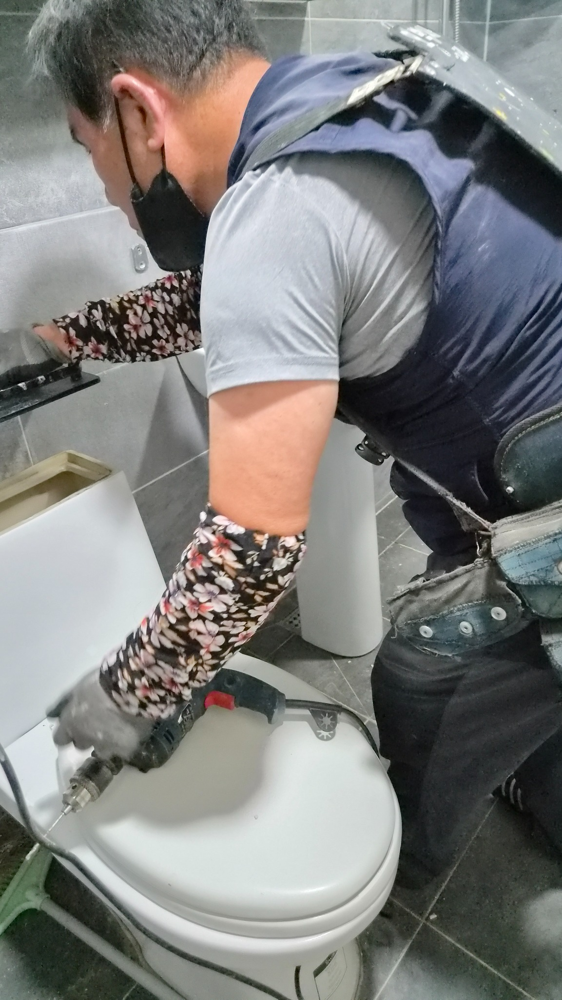
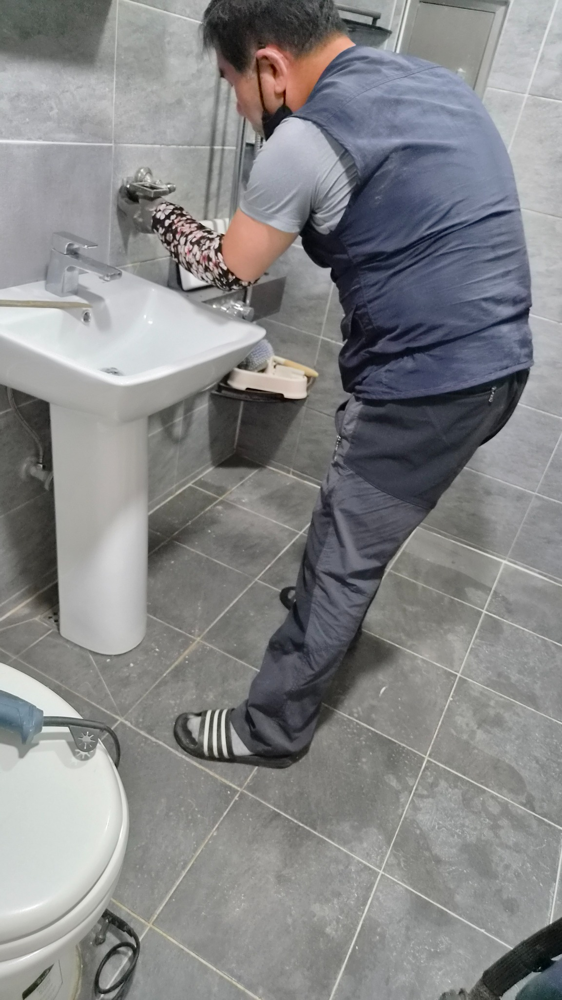
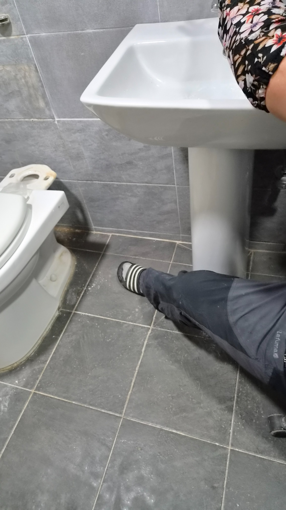
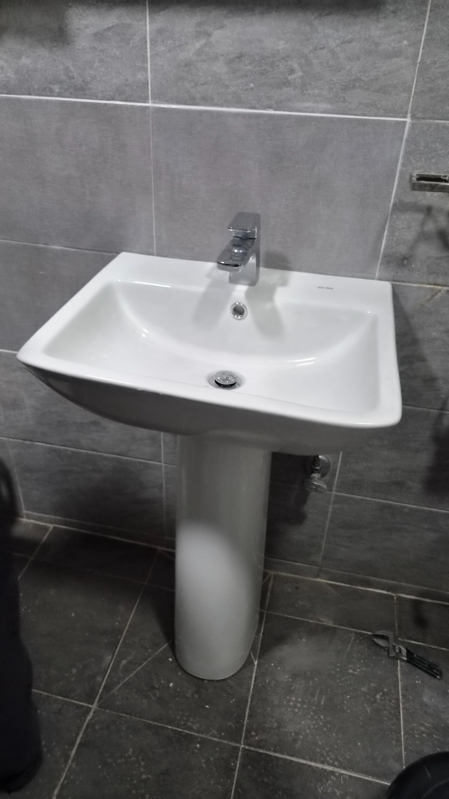

# 울산 북구 세면대 교체, 신천동 무지개아파트 세면대 붕괴 복구

간밤에 통째로 떨어진 세면대. 벽체 고정 상태를 확인하고 긴다리 세면대로 하중을 나누어 안전하게 다시 시공했습니다.

## 새벽을 깨운 와장창 소리

집 안에서 갑자기 큰 소리가 난다는 것은 생각보다 훨씬 큰 불안으로 다가옵니다.

이번 현장은 울산 북구 신천동 무지개아파트에서 진행한 세면대 교체 사례입니다.

밤사이 욕실에서 큰 소리가 났고, 확인해 보니 세면대가 벽에서 통째로 떨어져 바닥에 깨져 있었습니다.

깨진 도기 조각이 바닥에 흩어져 있었고, 고객님은 놀란 마음을 쉽게 가라앉히지 못하고 계셨습니다.

### 문제는 보이지 않는 곳에 있었습니다

고객님께서는 약 6년 전 욕실 리모델링을 하셨다고 말씀하셨습니다.

겉으로는 멀쩡해 보였지만, 기존 세면대 고정 상태를 확인하니 벽 안쪽 단단한 구조체가 아닌 빈 공간에 칼블럭이 들어가 있었습니다.

쉽게 말해 무거운 도기를 허공에 가까운 상태로 버티게 한 셈입니다.

### 왜 긴다리 세면대를 선택했을까

반다리 세면대는 깔끔하지만 벽 고정 상태가 약하면 위험할 수 있습니다.

긴다리 세면대는 벽에서 한 번 잡아주고, 바닥에서 한 번 더 받쳐주기 때문에 하중을 더 안정적으로 나눌 수 있습니다.

이번 현장에서는 안전을 우선해 긴다리 세면대로 재시공했습니다.

## 철거부터 고정, 누수 확인까지

먼저 깨진 도기와 파편을 안전하게 수거했습니다.

기존의 부실한 칼블럭과 고정 장치도 모두 제거했습니다.

이후 수평을 잡고 벽 안쪽 단단한 구조체를 확인해 타공 작업을 진행했습니다.

새 고정 앙카를 견고하게 설치하고, 긴다리 받침대를 함께 사용해 하중을 분산했습니다.

마지막으로 수전 작동, 배수 상태, 흔들림 여부를 여러 차례 확인했습니다.

## 작은 흔들림이 큰 사고의 시작일 수 있습니다

세면대가 조금 흔들리거나, 벽과 틈이 벌어져 있거나, 실리콘이 심하게 갈라져 있다면 그냥 넘기지 않는 것이 좋습니다.

특히 오래된 아파트나 과거 리모델링 이력이 있는 욕실이라면 한 번쯤 고정 상태를 확인해 보시는 것이 좋습니다.

시공은 완성되는 순간보다 시간이 흐른 뒤 결과가 더 분명하게 드러납니다.

오늘 멀쩡해 보여도 5년 뒤, 10년 뒤까지 안전해야 진짜 좋은 시공입니다.

## 짧은 영상으로 보는 현장 흐름

세면대가 떨어진 현장부터 긴다리 세면대로 안정적으로 재시공하는 흐름을 짧은 영상으로도 확인할 수 있습니다.

## 울산 세면대 교체와 욕실 수리는 안전 점검이 먼저입니다

세면대가 흔들리거나 벽 고정이 불안해 보인다면 미루지 말고 확인해 보세요.
