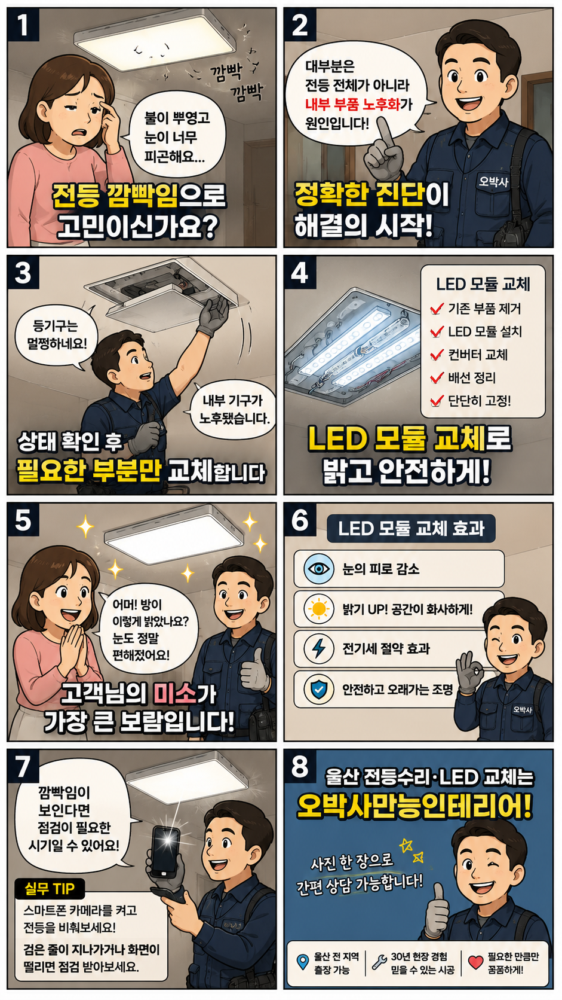
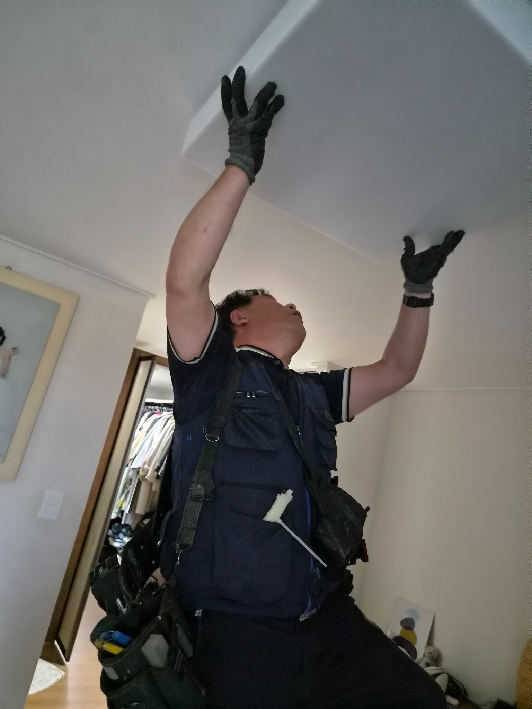
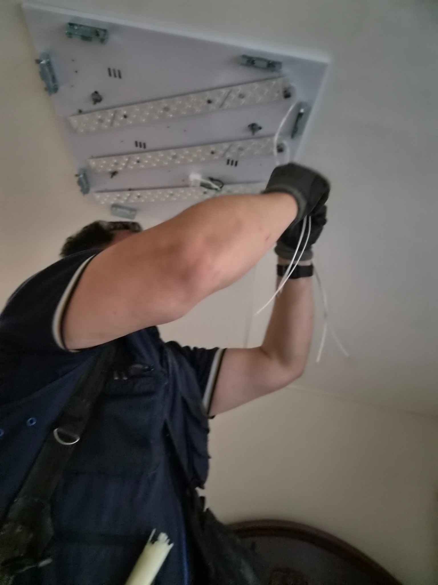
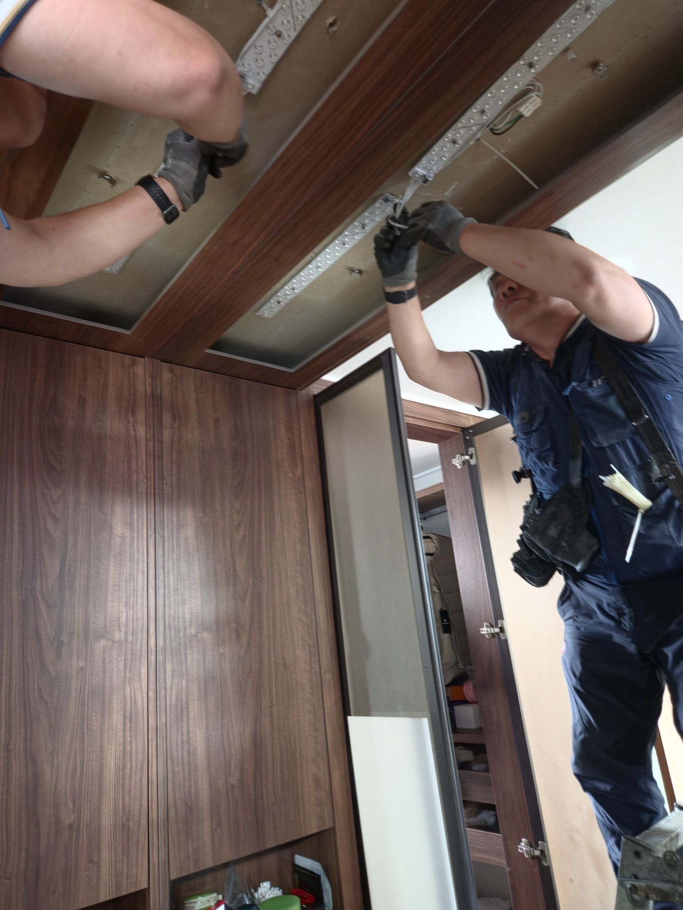
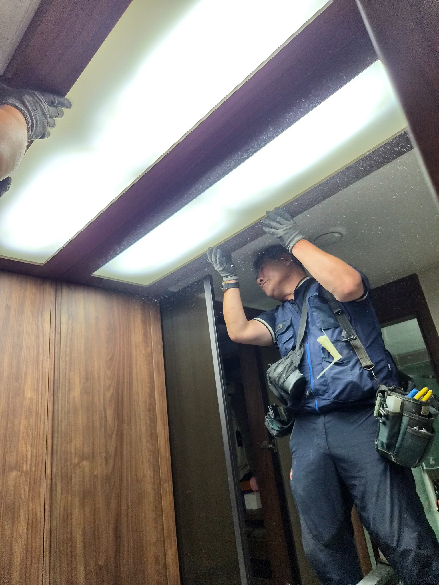
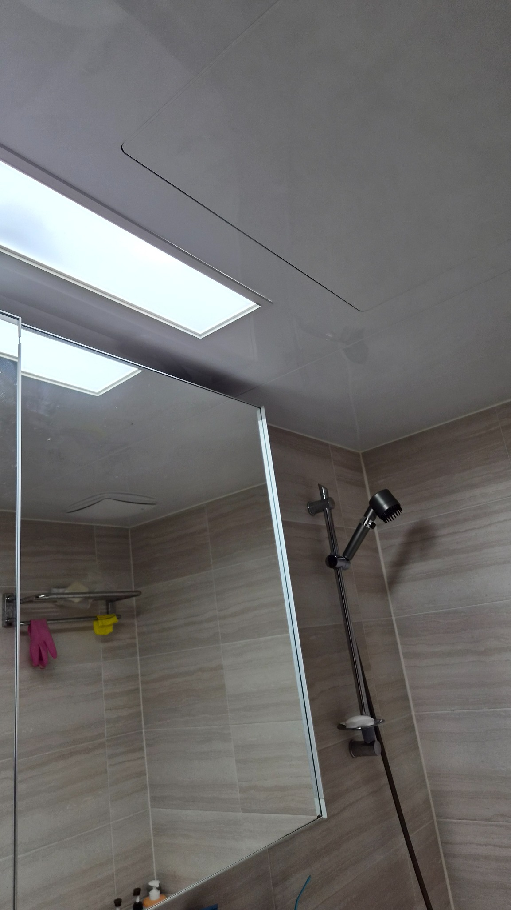
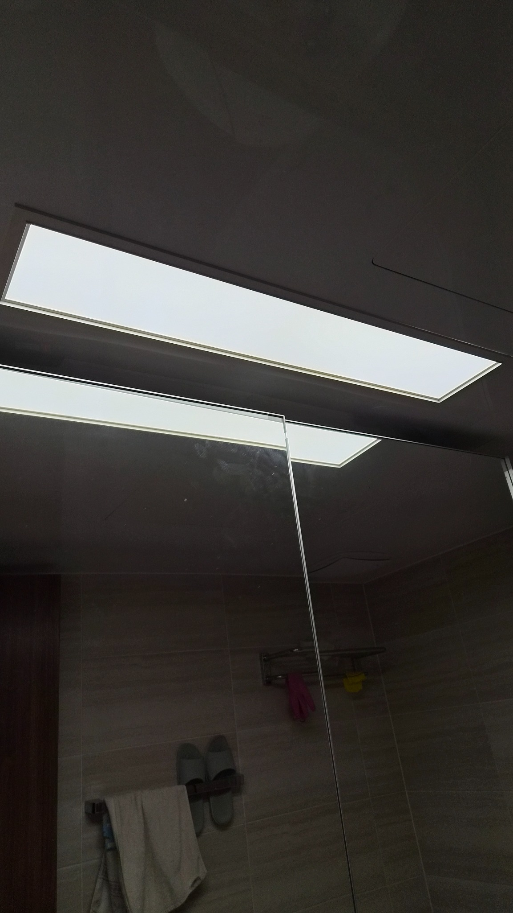

# 울산 북구 매곡동 에일린의뜰 전등 깜빡임, LED 모듈 교체로 밝고 편안하게

뿌옇고 깜빡거리던 전등을 전체교체하지 않고 내부 LED 모듈과 컨버터 중심으로 정리했습니다. 눈이 편해지고 공간이 다시 환해진 조명수리 현장입니다.

## 불은 켜지는데, 방이 뿌옇게 느껴졌습니다

조명은 집의 표정을 바꿉니다. 밝아야 할 공간이 흐릿해지면 생활의 리듬도 같이 무거워집니다.

이번 현장은 울산 북구 매곡동 에일린의뜰 1차 아파트에서 진행한 전등수리 사례입니다.

고객님께서는 방등이 뿌옇고 미세하게 깜빡거려 눈이 피곤하다고 말씀하셨습니다.

현장에서 확인해 보니 등기구 외관은 양호했지만 내부 부품의 노후화가 진행된 상태였습니다.

### 무조건 전체교체를 권하지 않았습니다

오박사만능인테리어는 현장에서 먼저 살릴 수 있는 부분과 교체해야 할 부분을 나눠 봅니다.

이번 조명은 외부 커버와 본체 상태가 괜찮아 전체를 뜯어낼 필요가 없었습니다.

그래서 내부의 노후 부품을 정리하고 LED 모듈 교체 방식으로 비용 부담을 줄였습니다.

### 작업 순서

- 차단기 확인 후 안전하게 작업 준비

- 기존 등기구 커버와 내부 부품 상태 점검

- 노후된 부품과 배선 정리

- LED 모듈과 컨버터 설치

- 점등 확인 후 밝기와 고정 상태 점검

## 현장 사진으로 보는 LED 모듈 교체 과정

천장 조명은 겉으로 보기에는 단순해 보여도 내부 배선과 고정 상태가 중요합니다.

오래 사용할 수 있도록 모듈 위치와 배선 정리, 커버 조립까지 꼼꼼하게 마무리했습니다.

## 8컷 웹툰으로 보는 조명수리 포인트

전등 깜빡임은 그냥 참고 넘길 일이 아닙니다. 상태를 확인하고 필요한 부분만 바꾸면 집 안의 밝기와 생활감이 달라집니다.

## 불을 켜는 순간, 공간이 다시 살아났습니다

작업을 마치고 조명을 켜자 흐릿했던 느낌이 사라지고 빛이 고르게 퍼졌습니다.

눈이 편안해졌다는 고객님의 한마디가 이번 작업의 가장 큰 보람이었습니다.

조명은 단순히 밝히는 장치가 아니라 집 안의 분위기와 하루의 피로를 좌우하는 생활 요소입니다.

전등이 깜빡거리거나 예전보다 어둡게 느껴진다면 사진 한 장만 보내주셔도 상태 확인이 가능합니다.

## 울산 전등수리·LED 모듈 교체 상담

울산 북구 매곡동, 호계동, 화봉동, 송정동, 신천동 등 울산 전 지역 생활 집수리와 조명수리를 꼼꼼하게 도와드립니다.
