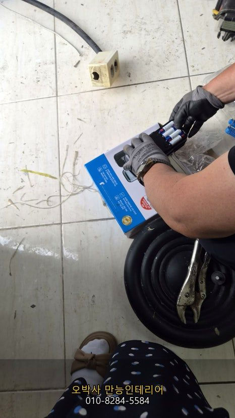
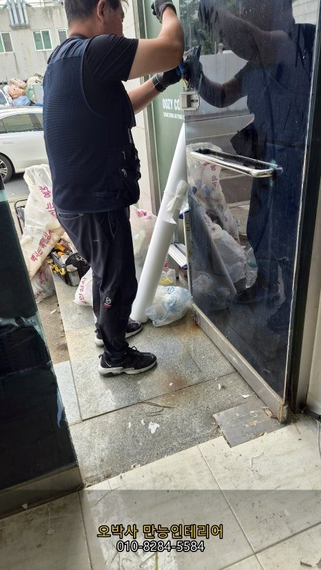
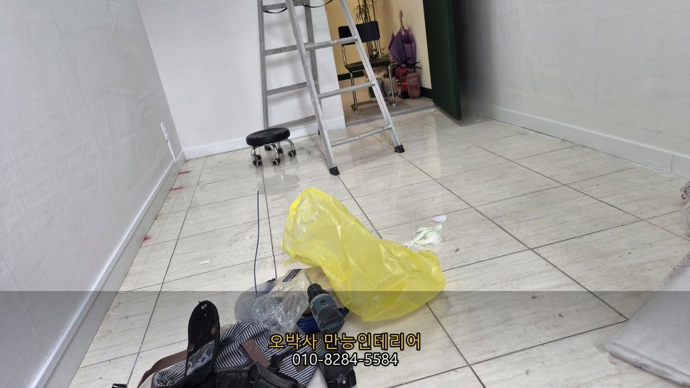
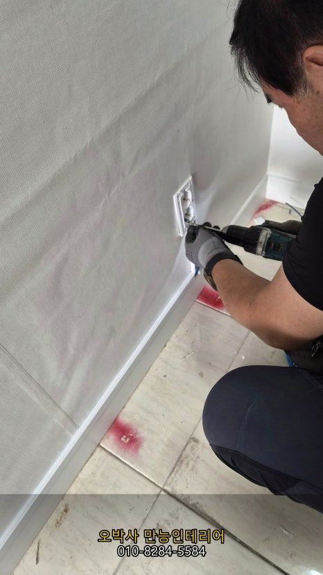
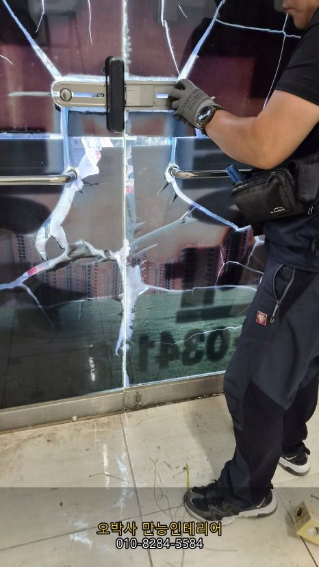
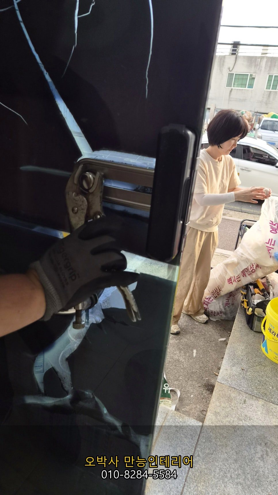
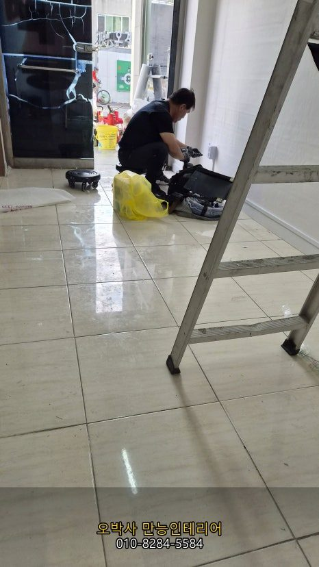
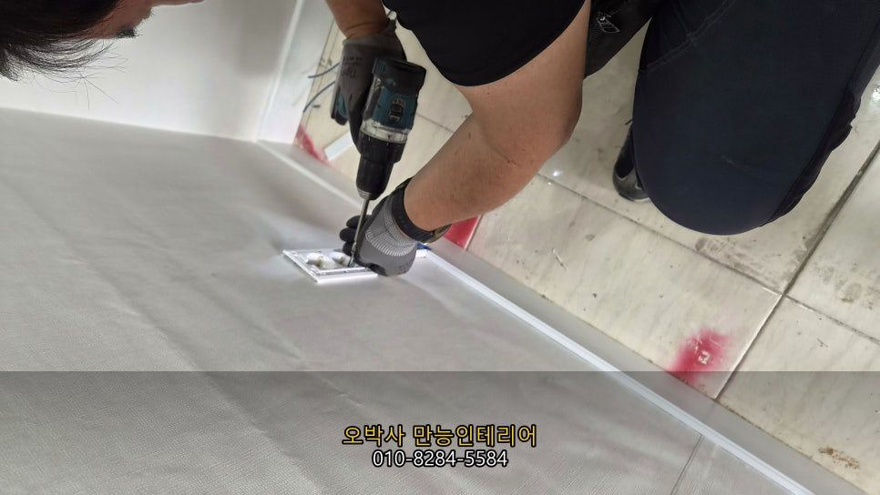
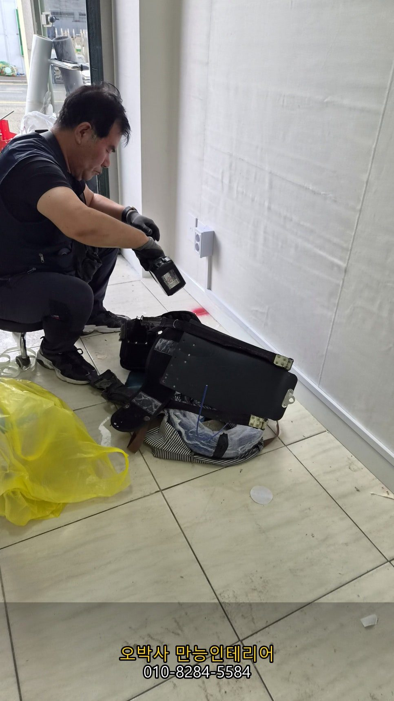

## 현장 확인
현장에서는 눈에 보이는 증상만 확인하지 않고, 문제가 시작된 위치와 주변 상태를 함께 살폈습니다.
작은 불편처럼 보여도 원인을 놓치면 같은 문제가 다시 반복될 수 있기 때문입니다.

## 작업 과정
작업은 필요한 부분을 먼저 정리하고, 현장 상태에 맞춰 순서대로 진행했습니다.
무리하게 넓은 범위를 건드리기보다 실제 원인이 되는 부분을 정확히 잡는 데 집중했습니다.

## 마무리 점검
마무리 단계에서는 사용 중 불편이 남지 않도록 다시 점검했습니다.
고객님이 바로 안심하고 사용할 수 있는 상태인지 확인한 뒤 현장을 정리했습니다.

## 상담 안내
비슷한 증상이나 확인이 필요한 부분이 있다면 전화로 바로 상담할 수 있습니다.
